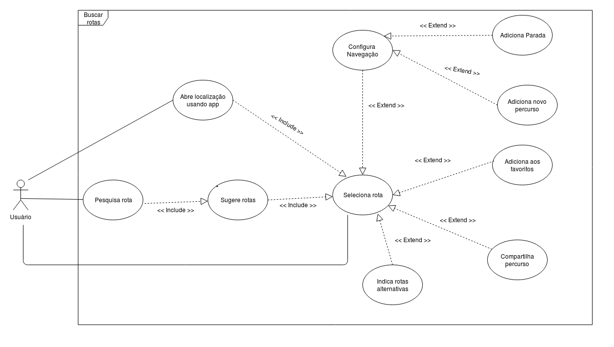
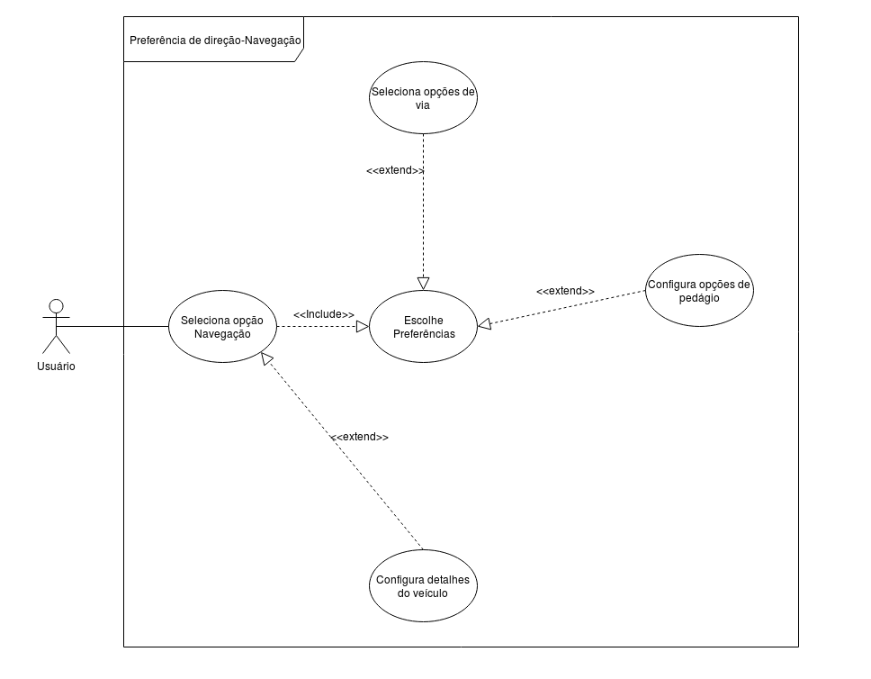
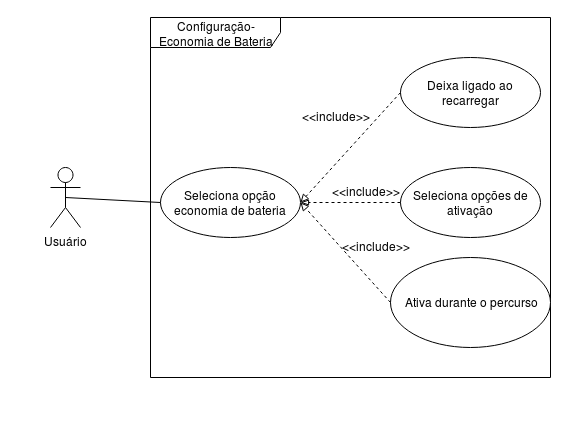
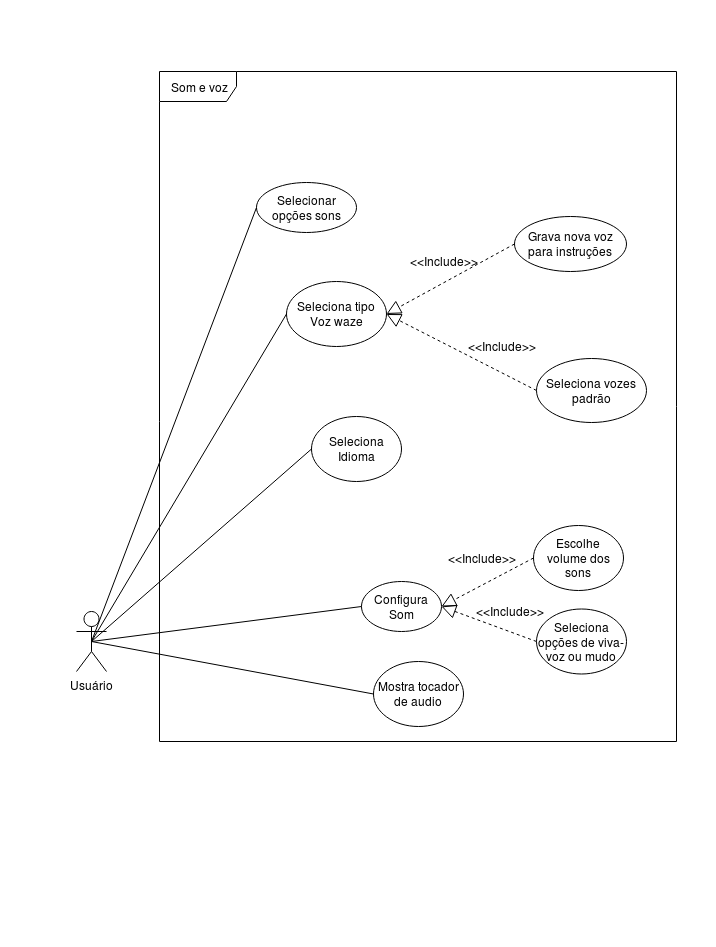
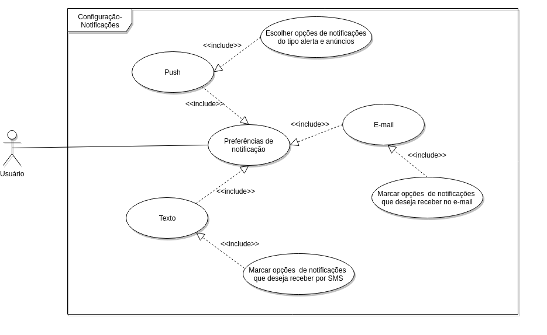
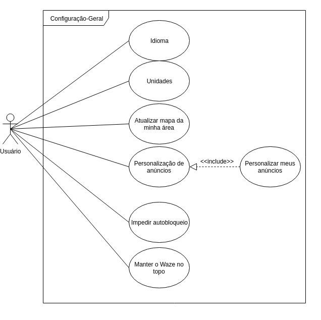
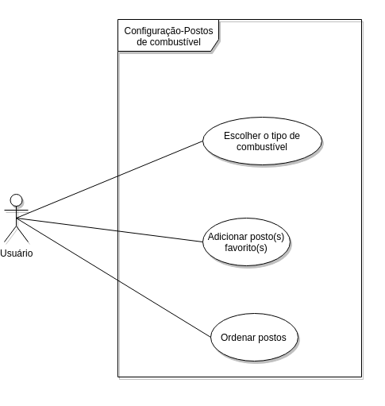

# Casos de uso

## 1. Introdução
O *diagrama de casos de uso* documenta o que o sistema faz do ponto de vista do usuário, descrevendo as principais funcionalidades do sistema e sua interação com os usuários. Nesse diagrama não nos aprofundamos em detalhes técnicos que dizem como o sistema faz.

## 2. Casos de uso :

## Versão 2

### **UC01 - Buscar Rota ( Para onde? )**

| UC1 | informações | 
|:----:|:------:|
|**Caso de uso**|Buscar Rota|
|**Data**|16/11/19|
|**Hora**|16:00|
|**Autor(es)**|Matheus de Cristo, Moacir Mascarenha|
|**Ator**| Usuário|
|**Fluxo principal** | **FP1:**  - Usuário acessa o Waze  - Usuário pressiona o icone de pesquisa  - Usuário insere o local desejado  - Usuário escolhe uma das rotas sugeridas  |
|**Fluxo alternativo**|**FA1**:  - Usuário abre localização(no Waze) recebida em outro App.  - O usuário recebe a rota até a localização **FA2:**  - Usuário acessa o Waze  - Usuário pressiona o icone de pesquisa  - Usuário insere o local desejado  - Usuário escolhe uma das rotas sugeridas  - Usuário adiciona a rota aos favoritos **FA3:**  - Usuário acessa o Waze  - Usuário pressiona o icone de pesquisa  - Usuário insere o local desejado  - Usuário escolhe uma das rotas sugeridas  - Usuário escolhe a opção de navegação|
|**Versão**| Atual: 2.0   Anterior: [1.0](https://requisitos-de-software.github.io/2019.2-Waze/CasoDeUso/#uc01-buscar-rota-para-onde_1)|
|**Software Utilizado**|Draw.io| 

### **UC02 - Informações sobre o veículo**

| UC02 | informações | 
|:----:|:------:|
|**Caso de uso**|Informações sobre o veículo|
|**Data**|26/09/19|
|**Hora**|15:38|
|**Autor(es)**|João Pedro, Matheus Estanislau|
|**Fluxo principal** | **FP1:**  - Usuário acessa o Waze  - Usuário pressiona botão "informação do carro"  - Usuário indica tipo de veiculo |
|**Fluxo alternativo**|**FA1**:  - Usuário acessa o Waze  - Usuário pressiona botão "informação do carro"  - Tipo de combustivel  **FA2:**  - Usuário acessa o Waze  - Usuário pressiona botão "informação do carro"  - Placa do veículo  - Usuário digita placa de seu veiculo  **FA3:**  - Usuário acessa o Waze  - Usuário pressiona botão "informação do carro"  - Mais opções de rotas|
|**Versão**|Atual: 2.0   Anterior: [1.0](https://requisitos-de-software.github.io/2019.2-Waze/CasoDeUso/#uc02-informacoes-sobre-o-veiculo_1)|
|**Software Utilizado**|Lucidchart|

### **UC03 - Exibição de mapa**

| UC03 | informações | 
|:----:|:------:|
|**Caso de uso**|Exibição de mapa|
|**Data**|26/09/19|
|**Hora**|16:25|
|**Autor(es)**|Matheus de Cristo, Moacir Mascarenha|
|**Ator**|Usuário|
|**Fluxo principal** | **FP1:**  - Usuário acessa o Waze  - Usuário pressiona botão de configurações  - Usuário pressiona exibição de mapa |
|**Fluxo alternativo**|**FA1**:  - Usuário acessa o Waze  - Usuário pressiona botão de configurações  - Usuário pressiona exibição de mapa - Usuário escolhe umas das opções de exibir no mapa **FA2:**  - Usuário acessa o Waze  - Usuário pressiona botão de configurações  - Usuário pressiona exibição de mapa   - Usuário pressiona a label Velocimetro **FA3:**  - Usuário acessa o Waze  - Usuário pressiona botão de configurações  - Usuário pressiona exibição de mapa  - Outras Opções |
|**Versão**|Atual: 2.0   Anterior: [1.0](https://requisitos-de-software.github.io/2019.2-Waze/CasoDeUso/#uc03-exibicao-de-mapa_1)|
|**Software Utilizado**|Draw.io|

### **UC04 - Navegação**

| UC04 | informações | 
|:----:|:------:|
|**Caso de uso**|Navegação|
|**Data**|16/11/19|
|**Hora**|19:26|
|**Autor(es)**|Matheus de Cristo, Moacir Mascarenha|
|**Ator**|Usuário|
|**Fluxo principal** | **FP1:**  - Usuário acessa o Waze  - Usuário pressiona botão de configurações  - Usuário pressiona Navegação  - Usuário acessa menu de preferencias|
|**Fluxo alternativo**|**FA1**:  - Usuário acessa o Waze  - Usuário pressiona botão de configurações  - Usuário pressiona Navegação  - Usuário acessa o menu de Preferências  - Usuário escolhe alguma das opções(Evitar pedágio, passes de pedágio, Evitar balsas, Evitar vias expressas, Vias de terra e Evitar conversões difíceis) **FA2:**  - Usuário acessa o Waze  - Usuário pressiona botão de configurações  - Usuário pressiona exibição de mapa   - Usuário pressiona detalhes do veículo  -Usuário especifica detalhes sobre veículo  |
|**Versão**|Atual: 2.0   Anterior: [1.0](https://requisitos-de-software.github.io/2019.2-Waze/CasoDeUso/#uc04-navegacao_1) |
|**Software Utilizado**|Draw.io|

### **UC05 - Economia de bateria**

| UC05 | informações | 
|:----:|:------:|
|**Caso de uso**|Economia de bateria|
|**Data**|16/11/19|
|**Hora**|15:30|
|**Autor(es)**| Matheus de Cristo, Moacir Mascarenha|
|**Ator**|Usuário|
|**Fluxo principal** | **FP1:**  - Usuário acessa o Waze  - Usuário pressiona botão de configurações  - Usuário pressiona Economia de bateria
|**Fluxo alternativo**|**FA1**:  - Usuário acessa o Waze  - Usuário pressiona botão de configurações  -  Usuário pressiona Economia de bateria  - Usuário acessa a opção Deixar ligado ao recarregar **FA2:**  - Usuário acessa o Waze  - Usuário pressiona botão de configurações  -  Usuário pressiona Economia de bateria  - Usuário acessa a opção Economia de bateria **FA3:**  - Usuário acessa o Waze  - Usuário pressiona botão de configurações  -  Usuário pressiona Economia de bateria  - Usuário acessa a opção Ligar durante o percurso atual  |
|**Versão**|Atual: 2.0   Anterior: [1.0](https://requisitos-de-software.github.io/2019.2-Waze/CasoDeUso/#uc05-economia-de-bateria_1)|
|**Software Utilizado**|Draw.io|

### UC06 - Voz e som

| UC06 | informações | 
|:----:|:------:|
|**Caso de uso**|Voz e som|
|**Data**|16/10/19|
|**Hora**|16:13|
|**Autor(es)**| Matheus de Cristo, Moacir Mascarenha|
|**Ator**|Usuário|
|**Fluxo principal** | **FP1:**  - Usuário acessa o Waze  - Usuário pressiona botão de configurações  - Usuário pressiona Voz e som
|**Fluxo alternativo**|**FA1**:  - Usuário acessa o Waze  - Usuário pressiona botão de configurações  -  Usuário pressiona Voz e som  - Usuário acessa a opção Sons **FA2:**  - Usuário acessa o Waze  - Usuário pressiona botão de configurações  -  Usuário pressiona Voz e som  - Usuário acessa a opção Voz Waze **FA3:**  - Usuário acessa o Waze  - Usuário pressiona botão de configurações  -  Usuário pressiona Voz e som  - Usuário acessa a opção Idioma de entrada. **FA4:**  - Usuário acessa o Waze  - Usuário pressiona botão de configurações  -  Usuário pressiona Voz e som  - Usuário acessa a opção Som **FA5:**  - Usuário acessa o Waze  - Usuário pressiona botão de configurações  -  Usuário pressiona Voz e som  - Usuário acessa a opção Mostrar tocador de áudio |
|**Versão**|Atual: 2.0   Anterior: [1.0](https://requisitos-de-software.github.io/2019.2-Waze/CasoDeUso/#uc06-voz-e-som_1) |
|**Software Utilizado**|Draw.io|

### UC07- Notificações

| UC07 | informações | 
|:----:|:------:|
|**Caso de uso**|Notificações|
|**Data**|13/10/19|
|**Hora**|04:18|
|**Autor(es)**| Moacir Mascarenha|
|**Fluxo principal** | **FP1:**  - Usuário acessa o Waze  - Usuário pressiona botão de configurações  - Usuário pressiona a opção de Notificações
|**Fluxo alternativo**|**FA1**:  - Usuário acessa o Waze  - Usuário pressiona botão de configurações  - Usuário pressiona a opção de Notificações - Usuário acessa a opção Push **FA2:**  - Usuário acessa o Waze  - Usuário pressiona botão de configurações  - Usuário pressiona a opção de Notificações - Usuário acessa a opção E-mail **FA3:**  - Usuário acessa o Waze  - Usuário pressiona botão de configurações  - Usuário pressiona a opção de Notificações - Usuário acessa a opção Texto |
|**Versão**|Atual: 2.0   Anterior: [1.0](https://requisitos-de-software.github.io/2019.2-Waze/CasoDeUso/#uc07-notificacoes)|
|**Software Utilizado**|Draw.io|

### UC08- Geral

| UC08 | informações | 
|:----:|:------:|
|**Caso de uso**|Geral|
|**Data**|13/10/19|
|**Hora**|03:14|
|**Autor(es)**| Moacir Mascarenha|
|**Fluxo principal** | **FP1:**  - Usuário acessa o Waze  - Usuário pressiona botão de configurações  - Usuário pressiona a opção de Geral
|**Fluxo alternativo**|**FA1**:  - Usuário acessa o Waze  - Usuário pressiona botão de configurações  - Usuário pressiona a opção de Geral - Usuário acessa a opção Idioma **FA2:**  - Usuário acessa o Waze  - Usuário pressiona botão de configurações  - Usuário pressiona a opção de Geral - Usuário acessa a opção Unidades **FA3:**  - Usuário acessa o Waze  - Usuário pressiona botão de configurações  - Usuário pressiona a opção de Geral - Usuário acessa a opção Atualizar mapa da minha área **FA4:**  - Usuário acessa o Waze  - Usuário pressiona botão de configurações  - Usuário pressiona a opção de Geral - Usuário acessa a opção Personalização de anúncios **FA5:**  - Usuário acessa o Waze  - Usuário pressiona botão de configurações  - Usuário pressiona a opção de Geral - Usuário acessa a opção Impedir bloqueio **FA6:**  - Usuário acessa o Waze  - Usuário pressiona botão de configurações  - Usuário pressiona a opção de Geral - Usuário acessa a opção Manter Waze no topo |
|**Versão**|Atual: 2.0   Anterior: [1.0](https://requisitos-de-software.github.io/2019.2-Waze/CasoDeUso/#uc08-geral)|
|**Software Utilizado**|Draw.io|

### UC09- Postos de Combustível

| UC08 | informações | 
|:----:|:------:|
|**Caso de uso**|Postos de Combustível|
|**Data**|13/10/19|
|**Hora**|03:32|
|**Autor(es)**| Moacir Mascarenha|
|**Fluxo principal** | **FP1:**  - Usuário acessa o Waze  - Usuário pressiona botão de configurações  - Usuário pressiona a opção de Postos de Combustível
|**Fluxo alternativo**|**FA1**:  - Usuário acessa o Waze  - Usuário pressiona botão de configurações  - Usuário pressiona a opção de Postos de Combustível - Usuário acessa a opção Tipo de combustível **FA2:**  - Usuário acessa o Waze  - Usuário pressiona botão de configurações  - Usuário pressiona a opção de Postos de Combustível - Usuário acessa a opção Ordenar por **FA3:**  - Usuário acessa o Waze  - Usuário pressiona botão de configurações  - Usuário pressiona a opção de Postos de Combustível por - Usuário acessa a opção Ordenar postos |
|**Versão**|Atual: 2.0   Anterior: [1.0](https://requisitos-de-software.github.io/2019.2-Waze/CasoDeUso/#uc09-postos-de-combustivel|
|**Software Utilizado**|Draw.io|

## Versão 1

### **UC01 - Buscar Rota ( Para onde? )**

| UC01 | informações | 
|:----:|:------:|
|**Caso de uso**|Buscar Rota|
|**Data**|25/09/19|
|**Hora**|23:33|
|**Autor(es)**|João Pedro, Moacir Mascarenha|
|**Fluxo principal** | **FP1:**  - Usuário acessa o Waze  - Usuário pressiona o icone de pesquisa  - Usuário insere o local desejado  - Usuário escolhe uma das rotas sugeridas  |
|**Fluxo alternativo**|**FA1**:  - Usuário abre localização(no Waze) recebida em outro App.  - O usuário recebe a rota até a localização **FA2:**  - Usuário acessa o Waze  - Usuário pressiona o icone de pesquisa  - Usuário insere o local desejado  - Usuário escolhe uma das rotas sugeridas  - Usuário adiciona a rota aos favoritos **FA3:**  - Usuário acessa o Waze  - Usuário pressiona o icone de pesquisa  - Usuário insere o local desejado  - Usuário escolhe uma das rotas sugeridas  - Usuário escolhe a opção de navegação|
|**Versão**|Atual: 1.0 |
|**Software Utilizado**|Draw.io| 

### **UC02 - Informações sobre o veículo**

**|João Pedro, Moacir Mascarenha|
|**Fluxo principal** | **FP1:**  - Usuário acessa o Waze  - Usuário pressiona botão "informação do carro"  - Usuário indica tipo de veiculo |
|**Fluxo alternativo**|**FA1**:  - Usuário acessa o Waze  - Usuário pressiona botão "informação do carro"  - Tipo de combustivel  **FA2:**  - Usuário acessa o Waze  - Usuário pressiona botão "informação do carro"  - Placa do veículo  - Usuário digita placa de seu veiculo  **FA3:**  - Usuário acessa o Waze  - Usuário pressiona botão "informação do carro"  - Mais opções de rotas|
|**Versão**|Atual: 1.0|
|**Software Utilizado**|Lucidchart|

### **UC03 - Exibição de mapa**

| UC03 | informações | 
|:----:|:------:|
|**Caso de uso**|Exibição de mapa|
|**Data**|26/09/19|
|**Hora**|18:55|
|**Autor(es)**|João Pedro, Moacir Mascarenha|
|**Fluxo principal** | **FP1:**  - Usuário acessa o Waze  - Usuário pressiona botão de configurações  - Usuário pressiona exibição de mapa |
|**Fluxo alternativo**|**FA1**:  - Usuário acessa o Waze  - Usuário pressiona botão de configurações  - Usuário pressiona exibição de mapa - Usuário escolhe umas das opções de exibir no mapa **FA2:**  - Usuário acessa o Waze  - Usuário pressiona botão de configurações  - Usuário pressiona exibição de mapa   - Usuário pressiona a label Velocimetro **FA3:**  - Usuário acessa o Waze  - Usuário pressiona botão de configurações  - Usuário pressiona exibição de mapa  - Outras Opções |
|**Versão**|Atual: 1.0|
|**Software Utilizado**|Draw.io|

### **UC04 - Navegação**

| UC04 | informações | 
|:----:|:------:|
|**Caso de uso**|Navegação|
|**Data**|26/09/19|
|**Hora**|19:26|
|**Autor(es)**|João Pedro, Moacir Mascarenha|
|**Fluxo principal** | **FP1:**  - Usuário acessa o Waze  - Usuário pressiona botão de configurações  - Usuário pressiona Navegação  - Usuário acessa menu de preferencias|
|**Fluxo alternativo**|**FA1**:  - Usuário acessa o Waze  - Usuário pressiona botão de configurações  - Usuário pressiona Navegação  - Usuário acessa o menu de Preferências  - Usuário escolhe alguma das opções(Evitar pedágio, passes de pedágio, Evitar balsas, Evitar vias expressas, Vias de terra e Evitar conversões difíceis) **FA2:**  - Usuário acessa o Waze  - Usuário pressiona botão de configurações  - Usuário pressiona exibição de mapa   - Usuário pressiona detalhes do veículo  -Usuário especifica detalhes sobre veículo  |
|**Versão**|Atual: 1.0|
|**Software Utilizado**|Draw.io|

### **UC05 - Economia de bateria**

| UC05 | informações | 
|:----:|:------:|
|**Caso de uso**|Economia de bateria|
|**Data**|07/10/19|
|**Hora**|06:00|
|**Autor(es)**| Moacir Mascarenha|
|**Fluxo principal** | **FP1:**  - Usuário acessa o Waze  - Usuário pressiona botão de configurações  - Usuário pressiona Economia de bateria
|**Fluxo alternativo**|**FA1**:  - Usuário acessa o Waze  - Usuário pressiona botão de configurações  -  Usuário pressiona Economia de bateria  - Usuário acessa a opção Deixar ligado ao recarregar **FA2:**  - Usuário acessa o Waze  - Usuário pressiona botão de configurações  -  Usuário pressiona Economia de bateria  - Usuário acessa a opção Economia de bateria **FA3:**  - Usuário acessa o Waze  - Usuário pressiona botão de configurações  -  Usuário pressiona Economia de bateria  - Usuário acessa a opção Ligar durante o percurso atual  |
|**Versão**|Atual: 1.0|
|**Software Utilizado**|Draw.io|

### UC06 - Voz e som

| UC06 | informações | 
|:----:|:------:|
|**Caso de uso**|Voz e som|
|**Data**|07/10/19|
|**Hora**|06:10|
|**Autor(es)**| Moacir Mascarenha|
|**Fluxo principal** | **FP1:**  - Usuário acessa o Waze  - Usuário pressiona botão de configurações  - Usuário pressiona Voz e som
|**Fluxo alternativo**|**FA1**:  - Usuário acessa o Waze  - Usuário pressiona botão de configurações  -  Usuário pressiona Voz e som  - Usuário acessa a opção Sons **FA2:**  - Usuário acessa o Waze  - Usuário pressiona botão de configurações  -  Usuário pressiona Voz e som  - Usuário acessa a opção Voz Waze **FA3:**  - Usuário acessa o Waze  - Usuário pressiona botão de configurações  -  Usuário pressiona Voz e som  - Usuário acessa a opção Idioma de entrada. **FA4:**  - Usuário acessa o Waze  - Usuário pressiona botão de configurações  -  Usuário pressiona Voz e som  - Usuário acessa a opção Som **FA5:**  - Usuário acessa o Waze  - Usuário pressiona botão de configurações  -  Usuário pressiona Voz e som  - Usuário acessa a opção Mostrar tocador de áudio |
|**Versão**|Atual: 1.0|
|**Software Utilizado**|Draw.io|

### UC07- Notificações

| UC07 | informações | 
|:----:|:------:|
|**Caso de uso**|Notificações|
|**Data**|13/10/19|
|**Hora**|04:18|
|**Autor(es)**| Moacir Mascarenha|
|**Fluxo principal** | **FP1:**  - Usuário acessa o Waze  - Usuário pressiona botão de configurações  - Usuário pressiona a opção de Notificações
|**Fluxo alternativo**|**FA1**:  - Usuário acessa o Waze  - Usuário pressiona botão de configurações  - Usuário pressiona a opção de Notificações - Usuário acessa a opção Push **FA2:**  - Usuário acessa o Waze  - Usuário pressiona botão de configurações  - Usuário pressiona a opção de Notificações - Usuário acessa a opção E-mail **FA3:**  - Usuário acessa o Waze  - Usuário pressiona botão de configurações  - Usuário pressiona a opção de Notificações - Usuário acessa a opção Texto |
|**Versão**|Atual: 1.0|
|**Software Utilizado**|Draw.io|

### UC08- Geral

| UC08 | informações | 
|:----:|:------:|
|**Caso de uso**|Geral|
|**Data**|13/10/19|
|**Hora**|03:14|
|**Autor(es)**| Moacir Mascarenha|
|**Fluxo principal** | **FP1:**  - Usuário acessa o Waze  - Usuário pressiona botão de configurações  - Usuário pressiona a opção de Geral
|**Fluxo alternativo**|**FA1**:  - Usuário acessa o Waze  - Usuário pressiona botão de configurações  - Usuário pressiona a opção de Geral - Usuário acessa a opção Idioma **FA2:**  - Usuário acessa o Waze  - Usuário pressiona botão de configurações  - Usuário pressiona a opção de Geral - Usuário acessa a opção Unidades **FA3:**  - Usuário acessa o Waze  - Usuário pressiona botão de configurações  - Usuário pressiona a opção de Geral - Usuário acessa a opção Atualizar mapa da minha área **FA4:**  - Usuário acessa o Waze  - Usuário pressiona botão de configurações  - Usuário pressiona a opção de Geral - Usuário acessa a opção Personalização de anúncios **FA5:**  - Usuário acessa o Waze  - Usuário pressiona botão de configurações  - Usuário pressiona a opção de Geral - Usuário acessa a opção Impedir bloqueio **FA6:**  - Usuário acessa o Waze  - Usuário pressiona botão de configurações  - Usuário pressiona a opção de Geral - Usuário acessa a opção Manter Waze no topo |
|**Versão**|Atual: 1.0|
|**Software Utilizado**|Draw.io|

### UC09- Postos de Combustível

| UC08 | informações | 
|:----:|:------:|
|**Caso de uso**|Postos de Combustível|
|**Data**|13/10/19|
|**Hora**|03:32|
|**Autor(es)**| Moacir Mascarenha|
|**Fluxo principal** | **FP1:**  - Usuário acessa o Waze  - Usuário pressiona botão de configurações  - Usuário pressiona a opção de Postos de Combustível
|**Fluxo alternativo**|**FA1**:  - Usuário acessa o Waze  - Usuário pressiona botão de configurações  - Usuário pressiona a opção de Postos de Combustível - Usuário acessa a opção Tipo de combustível **FA2:**  - Usuário acessa o Waze  - Usuário pressiona botão de configurações  - Usuário pressiona a opção de Postos de Combustível - Usuário acessa a opção Ordenar por **FA3:**  - Usuário acessa o Waze  - Usuário pressiona botão de configurações  - Usuário pressiona a opção de Postos de Combustível por - Usuário acessa a opção Ordenar postos |
|**Versão**|Atual: 1.0|
|**Software Utilizado**|Draw.io|

## 3. Referências Bibliográficas
>O que é UML e Diagramas de Caso de Uso: Introdução Prática à UML, Disponível em:
https://www.devmedia.com.br/o-que-e-uml-e-diagramas-de-caso-de-uso-introducao-pratica-a-uml/23408

>Editor gráfico online , Disponível em: https://www.draw.io/

>Revisão e compartilhamento de gráficos e diagramas, Disponível em: https://www.lucidchart.com

## 4. Histórico de Versões

| Data | Versão | Descrição | Autor(es) |
|:--:|:--:|:--:|:--:|
|25/09/19|1.0| Criado documento |João Pedro, Moacir Mascarenha|
|26/09/19|2.0| Ajustado UC01 |João Pedro, Moacir Mascarenha|
|26/09/19|2.1|Adicionado UC02 |João Pedro, Moacir Mascarenha|
|26/09/19|2.2|Adicionado UC03 |João Pedro, Moacir Mascarenha|
|27/09/19|2.3|Adicionado UC04 |João Pedro, Moacir Mascarenha|
|07/10/19|2.4|Atualizado UC02, UC03,UC04 |Moacir Mascarenha|
|07/10/19|2.5|Adicionado UC05 e UC06 | Moacir Mascarenha|
|16/10/19|2.6|Adicionado UC07,UC08 e UC09 | Moacir Mascarenha|
|17/11/19|3.0|Adicionado Versão 2 | Matheus Estanislau, Moacir Mascarenha|
|23/11/19|4.0|Ajjustados Casos de Uso de acordo com a verificação| João Pedro Matheus Estanislau |