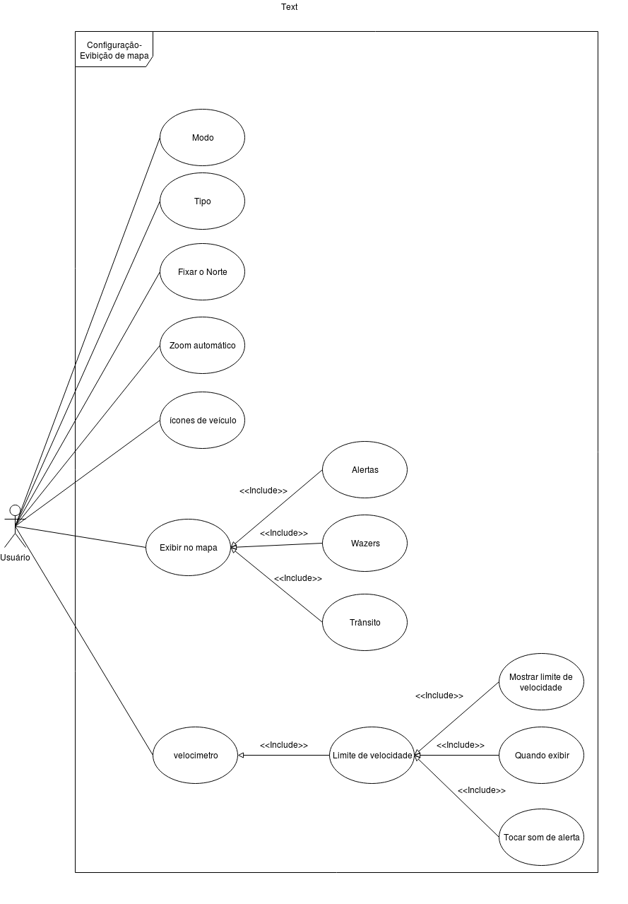

# Casos de uso

## 1. Introdução
O *diagrama de casos de uso* documenta o que o sistema faz do ponto de vista do usuário, descrevendo as principais funcionalidades do sistema e sua interação com os usuários. Nesse diagrama não nos aprofundamos em detalhes técnicos que dizem como o sistema faz.

## 2. Casos de uso :

### **UC1 - Buscar Rota ( Para onde? )**

| UC1 | informações | 
|:----:|:------:|
|**Caso de uso**|Buscar Rota|
|**Data**|25/09/19|
|**Hora**|23:33|
|**Autor(es)**|João Pedro, Moacir Mascarenha|
|**Fluxo principal** | **FP1:**  - Usuário acessa o Waze  - Usuário preciona o icone de pesquisa  - Usuário insere o local desejado  - Usuário escolhe uma das rotas sugeridas  |
|**Fluxo alternativo**|**FA1**:  - Usuário abre localização(no Waze) recebida em outro App.  - O usuário recebe a rota até a localização **FA2:**  - Usuário acessa o Waze  - Usuário preciona o icone de pesquisa  - Usuário insere o local desejado  - Usuário escolhe uma das rotas sugeridas  - Usuário adiciona a rota aos favoritos **FA3:**  - Usuário acessa o Waze  - Usuário preciona o icone de pesquisa  - Usuário insere o local desejado  - Usuário escolhe uma das rotas sugeridas  - Usuário escolhe a opção de navegação|
|**Software Utilizado**|Draw.io| 

### **UC2 - Detalhes do carro**

| UC2 | informações | 
|:----:|:------:|
|**Caso de uso**|Detalhes do carro|
|**Data**|26/09/19|
|**Hora**|15:38|
|**Autor(es)**|João Pedro, Moacir Mascarenha|
|**Fluxo principal** | **FP1:**  - Usuário acessa o Waze  - Usuário preciona botão "informação do carro"  - Usuário indica tipo de veiculo |
|**Fluxo alternativo**|**FA1**:  - Usuário acessa o Waze  - Usuário preciona botão "informação do carro"  - Tipo de combustivel  **FA2:**  - Usuário acessa o Waze  - Usuário preciona botão "informação do carro"  - Placa do veículo  - Usuário digita placa de seu veiculo  **FA3:**  - Usuário acessa o Waze  - Usuário preciona botão "informação do carro"  - Mais opções de rotas|
|**Software Utilizado**|Lucidchart|

### **UC3 - Exibição de mapa**

| UC3 | informações | 
|:----:|:------:|
|**Caso de uso**|Exibição de mapa|
|**Data**|26/09/19|
|**Hora**|18:55|
|**Autor(es)**|João Pedro, Moacir Mascarenha|
|**Fluxo principal** | **FP1:**  - Usuário acessa o Waze  - Usuário preciona botão de configurações  - Usuário preciona exibição de mapa |
|**Fluxo alternativo**|**FA1**:  - Usuário acessa o Waze  - Usuário preciona botão de configurações  - Usuário preciona exibição de mapa - Usuário escolhe umas das opções de exibir no mapa **FA2:**  - Usuário acessa o Waze  - Usuário preciona botão de configurações  - Usuário preciona exibição de mapa   - Usuário Preciona a label Velocimetro **FA3:**  - Usuário acessa o Waze  - Usuário preciona botão de configurações  - Usuário preciona exibição de mapa  - Outras Opções |
|**Software Utilizado**|Draw.io|

### **UC4 - Navegação**

| UC4 | informações | 
|:----:|:------:|
|**Caso de uso**|Navegação|
|**Data**|26/09/19|
|**Hora**|19:26|
|**Autor(es)**|João Pedro, Moacir Mascarenha|
|**Fluxo principal** | **FP1:**  - Usuário acessa o Waze  - Usuário preciona botão de configurações  - Usuário preciona Navegação  - Usuário acessa menu de preferencias|
|**Fluxo alternativo**|**FA1**:  - Usuário acessa o Waze  - Usuário preciona botão de configurações  - Usuário preciona Navegação  - Usuário acessa o menu de Preferências  - Usuário escolhe alguma das opções(Evitar pedágio, passes de pedágio, Evitar balsas, Evitar vias expressas, Vias de terra e Evitar conversões difíceis) **FA2:**  - Usuário acessa o Waze  - Usuário preciona botão de configurações  - Usuário preciona exibição de mapa   - Usuário preciona detalhes do veículo  -Usuário especifica detalhes sobre veículo  |
|**Software Utilizado**|Draw.io|

## 3. Referências Bibliográficas
>O que é UML e Diagramas de Caso de Uso: Introdução Prática à UML, Disponível em:
https://www.devmedia.com.br/o-que-e-uml-e-diagramas-de-caso-de-uso-introducao-pratica-a-uml/23408

>Editor gráfico online , Disponível em: https://www.draw.io/

>Revisão e compartilhamento de gráficos e diagramas, Disponível em: https://www.lucidchart.com

## Histórico de Versões

| Data | Versão | Descrição | Autor(es) |
|:--:|:--:|:--:|:--:|
|25/09/19|1.0| Criado documento |João Pedro, Moacir Mascarenha|
|26/09/19|2.0| Ajustado UC1 |João Pedro, Moacir Mascarenha|
|26/09/19|2.1|Adicionado UC2 |João Pedro, Moacir Mascarenha|
|26/09/19|2.2|Adicionado UC3 |João Pedro, Moacir Mascarenha|
|27/09/19|2.3|Adicionado UC4 |João Pedro, Moacir Mascarenha|