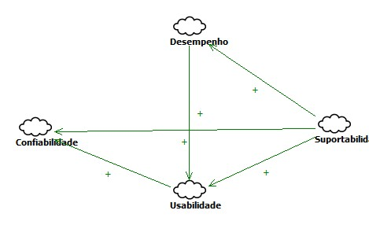
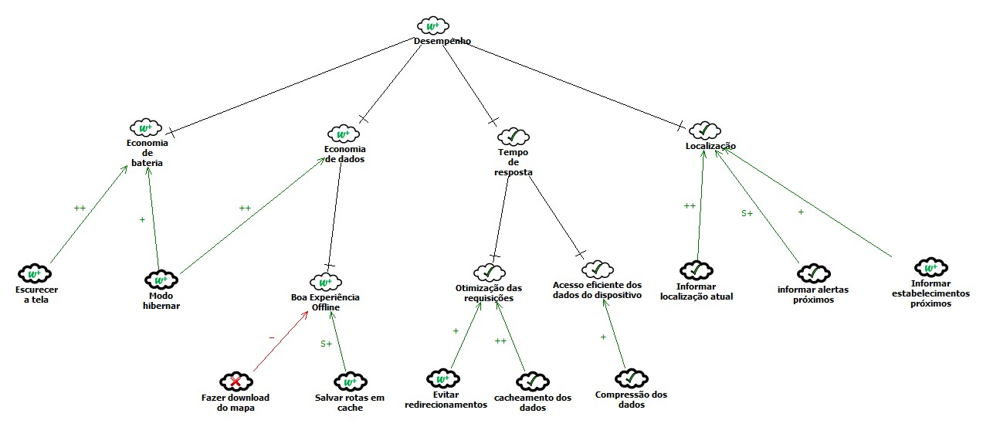
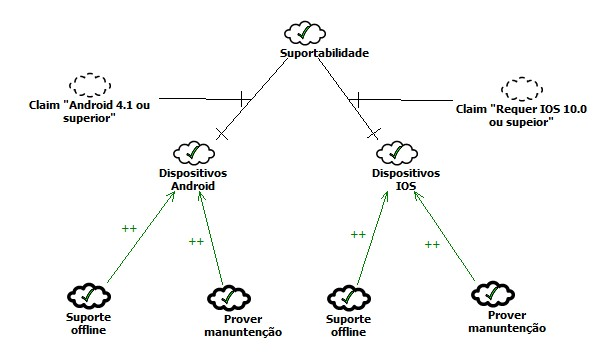
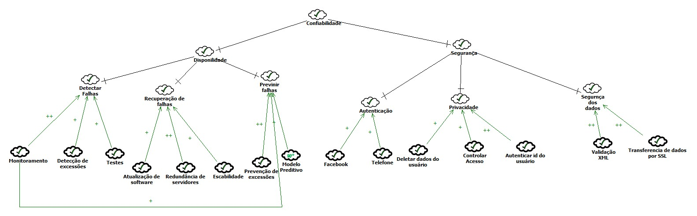

# NFR Framework

## Introdução 

O NFR Framework trata-se de um framework conceitual orientado a requisitos não funcionais, ele decompõe os requisitos facilitando assim a compreensão e a priorização destes requisitos.

## Metodologia

| Tag NFR | Atores |  
|--|--|
|**Data**| -- |
|**Hora**| -- |
|**Autor(es)**| -- |
|**Rastro**| --- |

## Ferramenta utilizada

Ferramenta utilizada foi o Star UML disponível no link: StarUML.io

## NFR00 - Geral 

| NFR00 | Atores |  
|--|--|
|**Data**| 16/10/2019 |
|**Hora**| 16h30 |
|**Autor(es)**| Lucas Alexandre e Matheus Estanislau |
|**Rastro**| [Especificação suplementar](./EspSuplementar.md)|

## NFR01 - Usabilidade

| NFR01 | Atores |  
|--|--|
|**Data**| 15/10/2019 |
|**Hora**| 16h30 |
|**Autor(es)**| Lucas Alexandre e Matheus Estanislau |
|**Rastro**| [Especificação suplementar](./EspSuplementar.md/#.4-Usabilidades)|

### Análise do NFR de Usabilidade

## NFR02 - Desempenho

| NFR02 | Atores |  
|--|--|
|**Data**| 16/10/2019 |
|**Hora**| 17h10 |
|**Autor(es)**| Lucas Alexandre e Matheus Estanislau |
|**Rastro**| [Especificação suplementar](./EspSuplementar.md/#7-desempenho)|

### Análise do NFR de Desempenho

## NFR03 - Suportabilidade

| NFR03| Atores |  
|--|--|
|**Data**| 16/10/2019 |
|**Hora**| 17h30 |
|**Autor(es)**| Lucas Alexandre e Matheus Estanislau |
|**Rastro**| [Especificação suplementar](./EspSuplementar.md/#6-suportabilidade) |

### Análise do NFR de Suportabilidade

## NFR04 - Confiabiliade

| NFR04| Atores |  
|--|--|
|**Data**| 16/10/2019 |
|**Hora**| 18h13 |
|**Autor(es)**| Lucas Alexandre e Matheus Estanislau |
|**Rastro**| [Especificação suplementar](./EspSuplementar.md/#5-confiabilidade) |

### Análise do NFR de Confiabilidade

## Referências

## Histórico de versões

|Data|Versão|Descrição|Autor(es)|
|----|------|---------|---------|
|16/10/19|1.0|Criação do documento|Lucas Alexandre, Matheus Estanislau|
|16/10/19|1.1| Adicionado NFR desempenho e usabilidade| Lucas Alexandre, Matheus Estanislau|
|16/10/19|1.2| Adicionado NFR suportabilidade| Lucas Alexandre, Matheus Estanislau|
|16/10/19|1.3| Adicionado NFR Confiabilidade| Lucas Alexandre, Matheus Estanislau|
|16/10/19|1.4| Adicionados NFR de análise de Suportabilidade e Desempenho| Lucas Alexandre, Matheus Estanislau|
|16/10/19|1.5| Adicionados NFR de análise de Confiabilidade| Lucas Alexandre, Matheus Estanislau|
|16/10/19|1.6| Adicionados NFR de análise de Usabilidade| Lucas Alexandre, Matheus Estanislau|

