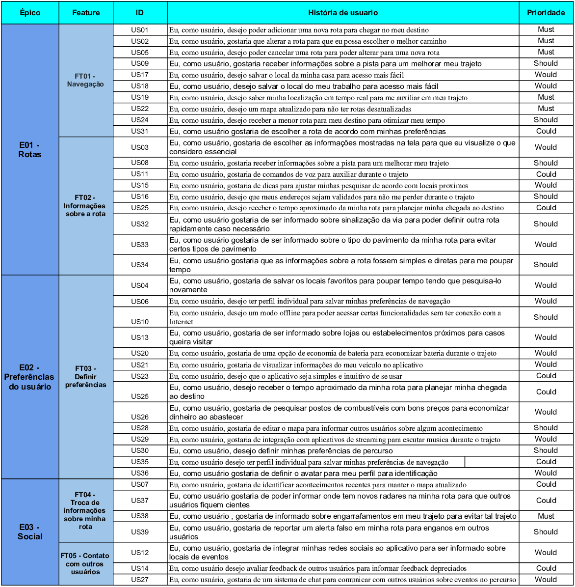

# Product Backlog

## Introdução

O Product Backlog é uma lista com todas as funcionalidades que são desejadas para um projeto. O conteúdo dessa lista é definido pelo Project Owner. Normalmente, o Product Backlog não é criado completamente no começo do projeto, pois inicialmente são adicionadas as ideias mais obvias e com o decorrer do projeto a lista vai ficando maior e mais completa, de acordo com as necessidades e mudanças ocorridas.

## Backlog

## Rastreabilidade
[Histórias de usuario](https://requisitos-de-software.github.io/2019.2-Waze/UserStories/)

## Referências Bibliográficas

> Cervone, H. (2011), "Understanding agile project management methods using Scrum", OCLC Systems & Services: International digital library perspectives, Vol. 27 No. 1, pp. 18-22. 

> Product Backlog. Disponível em: https://www.desenvolvimentoagil.com.br/scrum/product_backlog Acesso em: 15/10/19.

## Histórico de Versões
| Data | Versão | Descrição | Autor(es) |
|:--:|:--:|:--:|:--:|
|15/10/19|1.0|Criação do documento|Renan Cristyan|
|15/10/19|1.1|Adição da Introdução e de Referências Bibliográficas|Renan Cristyan|
|16/10/19|2.0|Adição da tabela de historias de usuário|João Pedro, Renan Cristyan|
|16/10/19|2.1|Criação das tabelas de Temas e Épicos|João Pedro, Renan Cristyan|
|16/10/19|2.2|Adicionados US08 até US33 na tabela de histórias de usuário|Renan Cristyan|
|17/10/19|2.3|Substituído Tema por Épico e Épico por Feature|Renan Cristyan|
|30/10/19|2.4|Refatoração|Lucas Alexandre, Moacir Mascarenha|
