# Questionario

## 1.Introdução

Questionário é uma técnica inflexível de elicitação de requisitos, pos é uma das técnicas que pode abranger um grande número de pessoas é o questionário. O seu uso é essencial quando se desejaobter informações de inúmeras pessoas. Além disso, justifica-se a sua aplicabilidade quando há indisponibilidade física, dispersão das pessoas envolvidas no projeto ou, até mesmo, quando há necessidade de um levantamento estatístico das pessoas que utilizaram o sistema.

## 2.Metodologia

O questionario faz uma divisão entre dois grupos: usuarios que usam o waze e usuarios que não usam, esta divisão foi feita para que o questionario não se delimitasse a apenas usuarios que usam waze e assim saber o por que esses usuarios não usam. podemos observar que a maior parte dos usuarios que responderam o questionario usam waze.

[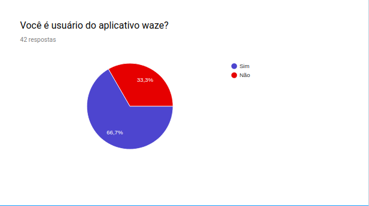](img/grafico1.png)

## 3.Usuarios que não usam waze

[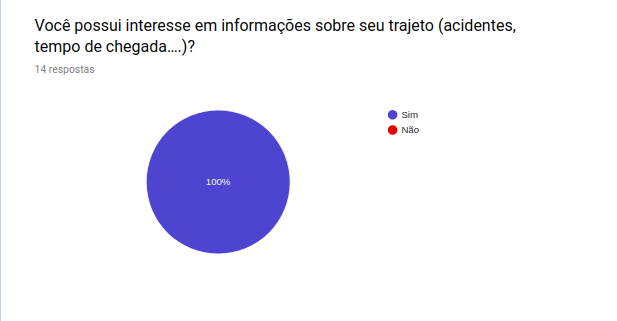](img/grafico2.png)
[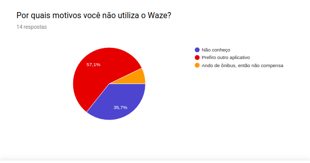](img/grafico3.png)
[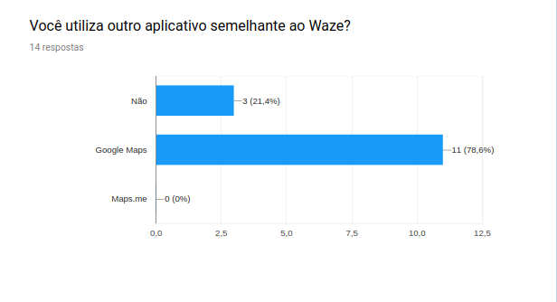](img/grafico4.png)

## 4.Experiência do usuário

[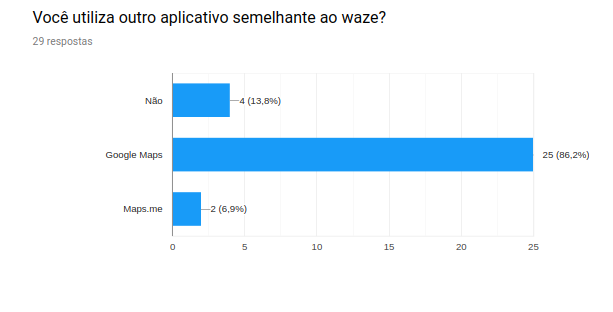](img/grafico5.png)
[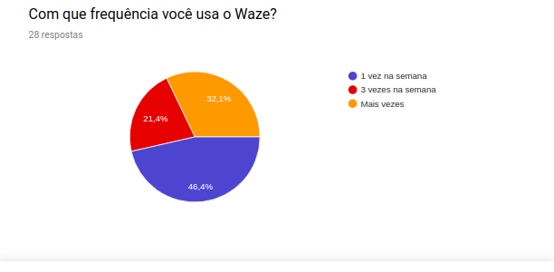](img/grafico6.png)
[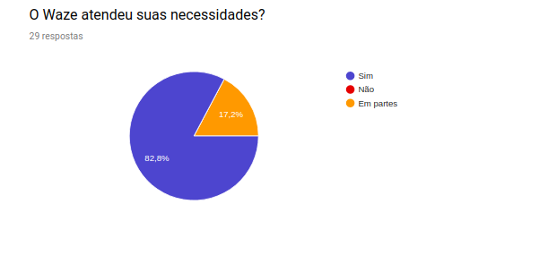](img/grafico7.png)
[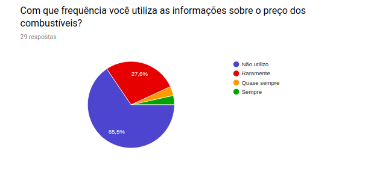](img/grafico8.png)
[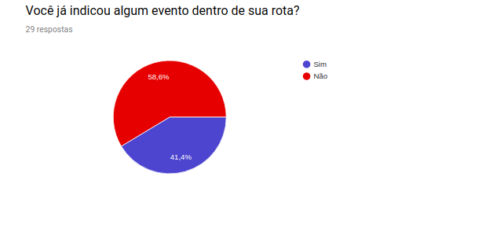](img/grafico9.png)
[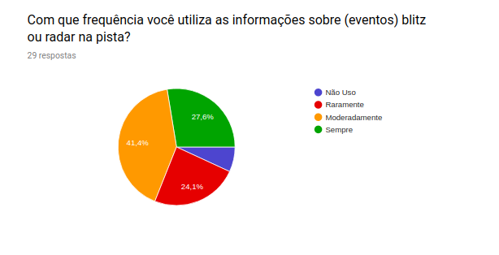](img/grafico10.png)
[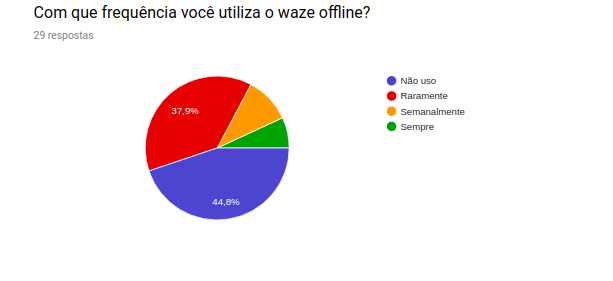](img/grafico11.png)
[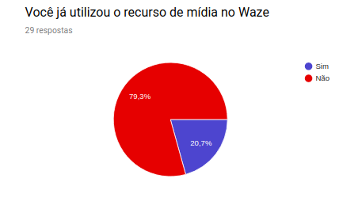](img/grafico12.png)

## 5.Feedback sobre waze

[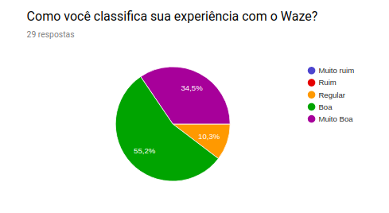](img/grafico13.png)
[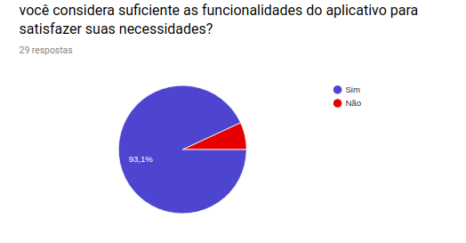](img/grafico14.png)

## 6.Analise

A partir dos resultado obtidos com o questionário, verificou-se que as funcionalidades de utilizar mídia no Waze através de outros aplicativos e informaçoes sobre estabelicimentos próximos teve uma baixa utilização no aplicativo.

Além disso, 100% dos questionados, até aqueles que não utilizam o Waze desejam ter informações sobre seu trajeto(acidentes ou tempo de chegada).

## 7.Requisitos elicitados

### MoSCoW

ID|Descrição| Prioridade
--|--------|-----------
Q01|O usuário deve ser informado sobre acontecimentos em sua rota(blitz ou acidentes)| Must
Q02|O aplicativo deve ter conexão com um aplicativo de mídia| Would
Q03|A navegação deve funcionar offline| Must
Q04|O usuário deve receber informações sobre a via(radares ou velocidade)| Should
Q05| O usuário deve informar eventos na sua rota| Could
Q06 | O usuário deve ser informado sobre estabelicimentos próximos | Would

## 8.Referências Bibliográficas

> ANÁLISE DAS TÉCNICAS DE LEVANTAMENTO DE REQUISITOS
PARA DESENVOLVIMENTO DE SOFTWARE NAS EMPRESAS DE
VITÓRIA DA CONQUISTA – BA. Disponível em: http://www2.uesb.br/computacao/wp-content/uploads/2014/09/AN%C3%81LISE-DAS-T%C3%89CNICAS-DE-LEVANTAMENTO-DE-REQUISITOS-PARA-DESENVOLVIMENTO-DE-SOFTWARE-NAS-EMPRESAS-DE-VIT%C3%93RIA-DA-CONQUISTA-%E2%80%93-BA.pdf. Acesso em 09/09/19

> Elicitação de requisitos, Questionario. Disponível em: https://fga-disciplinas.github.io/2019.1-Guia-Bolso/elicitacao-de-requisitos/questionario/

## 9.Histórico de Versões

|Data|Versão|Descrição|Autor(es)|
|----|------|---------|---------|
09/09/19|1.0|Criação do documento|João Pedro, Lucas Alexandre, Moacir Mascarenha|

