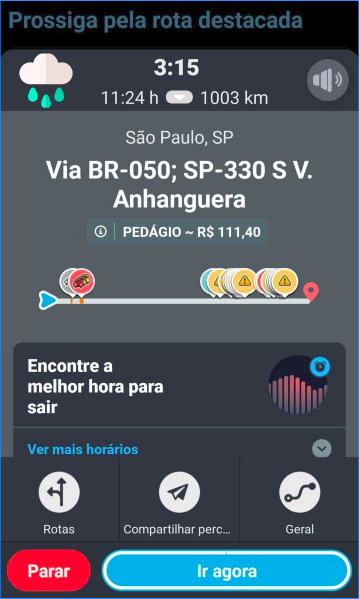
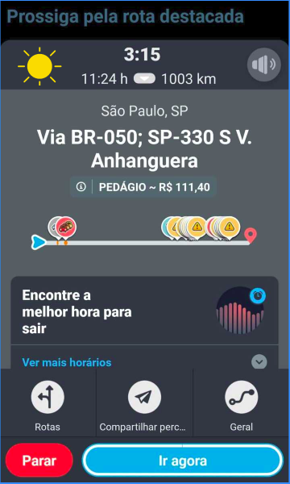
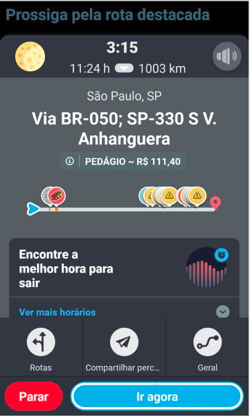

# Validação com prototipação

## Introdução

Validação é uma forma de avaliar se um modelo proposto atende às expectativas do usuário e ao requisitos elicitados. Esta validação uma funcionalidade que não tem no aplicativo.

## Objetivo

Foi feito um [prótipo](https://www.figma.com/proto/yqDCU6cnfGv4wZXEGliZe3/waze-clima?node-id=3%3A27&scaling=scale-down) simples com uma nova funcionalidade, com o objetivo de informar o usuário sobre as condições climática em seu trajeto.

## Protótipo
[Protótipo](https://www.figma.com/proto/yqDCU6cnfGv4wZXEGliZe3/waze-clima?node-id=3%3A27&scaling=scale-down)

### Tela 1

### Tela 2

### Tela 3

### Tela 4

### Tela 5

### Tela 6

## Testes com usuários
Foi solicitado aos participantes que realizasse a seguinte tarefa no protótipo:

- Verifique as informações climaticas da sua rota.

Em seguida foi solicitado que os mesmos respondessem as seguintes perguntas:

1. Teve dificuldade em usar a funcionalidade?
2. Quais os pontos positivos  e negativos nessa funcionalidade?
3. Você usaria esta funcionalidade se estivesse em seu aplicativo de navegação?

## Feedbacks

### **Teste 1**
Nome | Papel |
-----|------|
Moacir Mascarenha| Mediador
Lucas Siqueira| Participante

Data|Hora 
----|-----
24/11/19 | 11:13 

### Respostas

Questão | Resposta
--------|---------
1|Não.
2|Positivo: Ícone intuitivo. Negativo: Não me parece estar preparado para um lista com muitas cidades, não tem como pesquisar a cidade, não indica a probabilidade de chover e nem o horário
3|Sim

## Teste 2
Nome | Papel 
-----|-----
Lucas Alexandre| Mediador
Matheus Rodrigues| Participante

Data|Hora 
----|-----
24/11/19 | 16:36 

### Respostas

Questão | Resposta
--------|---------
1|Nao tive.
2| Positivo: A informacao de possivel chuva pode previnir possíveis transtornos. Negativo: Não vi a probabilidade de chuva nas cidades que estão entre o trajeto.
3|Usaria

### **Teste 3**
Nome | Papel 
-----|-----
Moacir Mascarenha | Mediador
Pedro Marques| Participante

Data|Hora 
----|-----
24/11/19 | 11:33 

### Respostas
Questão | Resposta
--------|---------
1| Não, o Ícone na parte superior esquerda se destacando é uma função importante, para avisos sobre condições climáticas.
2|Positivo: Funcionalidade, facilidade e alerta. Negativo: Nenhum.
3|Sim com certeza, ainda mais pra quem tem apenas a moto como meio de locomoção, seria uma ferramenta excelente.

### **Teste 4**
Nome | Papel 
-----|-----
Moacir Mascarenha | Mediador
Pedro Marques| Participante

Data|Hora 
----|-----
24/11/19 | 11:33 

### Respostas
Questão | Resposta
--------|---------
1| Sim.
2| Há muitas informações na tela e não fica claro onde é clicavel ou não. 
3| Não. Utilizaria apenas se tivesse um layout mais limpo com informações mais diretas.

## Conclusão
Conclui-se que os testes foram positivos, apesar de cada participante ter uma ideia diferente para a funcionalidade. A maioria dos participantes usariam tal funcionalidade.
 
## Referências

>Figma, Disponível em:www.figma.com

>Flaticon, Dísponinivel em: https://www.flaticon.com/

>GuiaBolso-Requisitos. Disponível em: https://fga-disciplinas.github.io/2019.1-Guia-Bolso/analise/validacao/ . Acesso em 12/11/2019.

## Histórico de Versões

|Data|Versão|Descrição|Autor(es)|
|----|------|---------|---------|
|25/11/19|1.0|Criação do documento|Lucas Alexandre e Moacir Mascarenha|