# Foward-From

## Introdução

A  rastreabilidade  de  requisitos  pode  ser  vista  como  a  habilidade  de  acompanhar  e  descrever a vida de um requisito, em ambas as direções; pré-rastreabilidade documenta  a  o  contexto  a  partir  do  qual  emergem  os  requisitos;  pós-rastreabilidade  vincula  os  requisitos  ao  desenho  do  sistema  e  sua  implementação  (DAVIS, 1993).

Um requisito é rastreável se é possível descobrir quem sugeriu o requisito (a fonte), por que o requisito existe (rationale), que outros requisitos estão relacionados a ele (dependência entre requisitos), e como o requisito se relaciona com outras informações, tais como desenho do sistema, implementação e documentação (SOMMERVILLE, 1998).

A  rastreabilidade  foward-from (para frente) liga os requisitos elicitados aos seus artefatos.

## Matriz de Rastreabilidade

|ID|Requisito|
|:--:|:--:|
|RQ01|O aplicativo deve indicar rotas de acordo com preferencias pré selecionadas pelo usuário|
|RQ02|O aplicativo deve informar sobre as condições da via|
|RQ03|O usuário pode dar feedback sobre as condições do seu percurso|
|RQ04|O aplicativo deve auxiliar a navegação por um guia de áudio|
|RQ05|O aplicativo deve informar a localização atual do usuário|
|RQ06|O usuário deve definir locais favoritos|
|RQ07|O aplicativo deve mostrar estabelecimentos importantes para o motorista|
|RQ08|O aplicativo deve fornecer informações sobre as condições da pista|
|RQ09|O aplicativo deve sugerir a menor rota|
|RQ10|O aplicativo deve sugerir o tempo aproximado de rota|
|RQ11|O aplicativo deve ter a opção para mudar a rota a qualquer momento|
|RQ12|O aplicativo deve disponibilizar uma funcionalidade para economia de bateria|
|RQ13|O aplicativo deve ter um sistema de chat|
|RQ14|O aplicativo deve ter integração com aplicativos de streaming|
|RQ15|O aplicativo deve ter o mapa atualizado|
|RQ16|O usuário deve ser capaz de avaliar feedback de outros usuários|
|RQ17|O aplicativo deve ser leve o suficiente para ter um bom desempenho na maioria dos dispositivos|
|RQ18|O aplicativo deve intuitivo e agradável|
|RQ19|O aplicativo deve ter suporte offline|
|RQ20|O aplicativo deve ter suporte para anúncios|
|RQ21|O usuário deve ser capaz de editar informações no mapa|
|RQ22|O aplicativo deve ter opção de evitar algumas situações durante o percurso|
|RQ23|O aplicativo deve poder definir suas preferências de percurso|
|RQ24|Precisão de rotas|
|RQ25|Mudança de Interface|
|RQ26|Veracidade de Informações de usuários|
|RQ27|O aplicativo deve consumir menos rede de dados / opção offline|
|RQ28|Design mais intuitivo|
|RQ29|Integração com redes sociais|
|RQ30|Aumentar tamanho (km) de rotas|
|RQ31|Cadastro de usuário e login|
|RQ32|A aplicação tem que solicitar ao usuário que ele digite o trajeto do destino|
|RQ33|A aplicação tem que solicitar ao usuário um destino|
|RQ34|Validar endereço|
|RQ35|O usuário tem que receber dicas de lugares para que ele possa ir caso tenha digitado metade do endereço ou o endereço errado|
|RQ36|O aplicativo deve informar ao usuário sobre o engarrafamento|
|RQ37|O aplicativo deve informar sobre estabelecimentos de interesse para motoristas|
|RQ38|O aplicativo de informar o tempo do percurso|
|RQ39|O aplicativo deve calcular a melhor rota para o destino desejado pelo usuário|
|RQ40|O aplicativo deve conter uma area comum para feedback do usuário|
|RQ41|O usuário deve ser informado sobre acontecimentos em sua rota|
|RQ42|O aplicativo deve ter conexão com um aplicativo de mídia|
|RQ43|A navegação deve funcionar offline|
|RQ44|O usuário deve receber informações sobre a via|
|RQ45|O usuário deve informar eventos na sua rota|
|RQ46|O usuário deve ser informado sobre estabelicimentos próximos|
|RQ47|O Waze deve mostrar um pequeno resumo sobre o que é o app|
|RQ48|O usuário deve ser capaz de utilizar o app sem fazer um cadastro/login|
|RQ49|Deve ser mostrado os termos de serviços|
|RQ50|O usuário deve ser capaz de informar que tipo de carro utiliza|
|RQ51|O usuário deve ser capaz de informar o destino|
|RQ52|O Aplicativo deve informar o tempo do percurso|
|RQ53|O Aplicativo deve informar a hora de chegada no destino|
|RQ54|O Aplicativo deve informar a velocidade do veiculo|
|RQ55|O usuario deve ser capaz de informar eventos na rota, como transito, acidentes e radares|
|RQ56|O usuário deve ser capaz de alterar a rota|
|RQ57|O usuário deve ser capaz de compartilhar sua rota|
|RQ58|O waze deve ter uma opção de economia de bateria|

# Detalhes

## RQ01 

| **RQ01** | **O aplicativo deve indicar rotas de acordo com preferencias pré selecionadas pelo usuário** |
|--|--|
| **Épico** | [E01](https://requisitos-de-software.github.io/2019.2-Waze/ProductBacklog/#2-backlog) |
| **Feature** | [FT01](https://requisitos-de-software.github.io/2019.2-Waze/ProductBacklog/#2-backlog) |
| **US** | [US08](https://requisitos-de-software.github.io/2019.2-Waze/UserStories/#3-historias-de-usuario)
[US33](https://requisitos-de-software.github.io/2019.2-Waze/UserStories/#3-historias-de-usuario) |
| **Funcionalidade** |  |

## RQ02 

| **RQ02** | **O aplicativo deve informar sobre as condições da via** |
|--|--|
| **Épico** | [E01](https://requisitos-de-software.github.io/2019.2-Waze/ProductBacklog/#2-backlog) |
| **Feature** | [FT02](https://requisitos-de-software.github.io/2019.2-Waze/ProductBacklog/#2-backlog) 
| **US** | [US08](https://requisitos-de-software.github.io/2019.2-Waze/UserStories/#3-historias-de-usuario),[US33](https://requisitos-de-software.github.io/2019.2-Waze/UserStories/#3-historias-de-usuario),[US34](https://requisitos-de-software.github.io/2019.2-Waze/UserStories/#3-historias-de-usuario) |
| **Funcionalidade** |  |

## RQ03
| **RQ03** | **O usuário pode dar feedback sobre as condições do seu percurso** |
|--|--|
| **Épico** | [E03](https://requisitos-de-software.github.io/2019.2-Waze/ProductBacklog/#2-backlog) |
| **Feature** | [FT04](https://requisitos-de-software.github.io/2019.2-Waze/ProductBacklog/#2-backlog) 
| **US** | [US07](https://requisitos-de-software.github.io/2019.2-Waze/UserStories/#3-historias-de-usuario) [US37](https://requisitos-de-software.github.io/2019.2-Waze/UserStories/#3-historias-de-usuario) |
| **Funcionalidade** |  |

## RQ04
| **RQ04** | **O aplicativo deve auxiliar a navegação por um guia de áudio** |
|--|--|
| **Épico** | [E01](https://requisitos-de-software.github.io/2019.2-Waze/ProductBacklog/#2-backlog) |
| **Feature** | [FT02](https://requisitos-de-software.github.io/2019.2-Waze/ProductBacklog/#2-backlog) 
| **US** | [US11](https://requisitos-de-software.github.io/2019.2-Waze/UserStories/#3-historias-de-usuario) |
| **Funcionalidade** |  |

## RQ05
| **RQ05** | **O aplicativo deve informar a localização atual do usuário** |
|--|--|
| **Épico** | [E01](https://requisitos-de-software.github.io/2019.2-Waze/ProductBacklog/#2-backlog) |
| **Feature** | [FT01](https://requisitos-de-software.github.io/2019.2-Waze/ProductBacklog/#2-backlog) 
| **US** | [US19](https://requisitos-de-software.github.io/2019.2-Waze/UserStories/#3-historias-de-usuario) |
| **Funcionalidade** |  |

## RQ06
| **RQ06** | **O usuário deve definir locais favoritos** |
|--|--|
| **Épico** | [E02](https://requisitos-de-software.github.io/2019.2-Waze/ProductBacklog/#2-backlog) |
| **Feature** | [FT03](https://requisitos-de-software.github.io/2019.2-Waze/ProductBacklog/#2-backlog) 
| **US** | [US04](https://requisitos-de-software.github.io/2019.2-Waze/UserStories/#3-historias-de-usuario) |
| **Funcionalidade** |  |

## RQ07
| **RQ07** | **O aplicativo deve mostrar estabelecimentos importantes para o motorista** |
|--|--|
| **Épico** | [E02](https://requisitos-de-software.github.io/2019.2-Waze/ProductBacklog/#2-backlog) |
| **Feature** | [FT03](https://requisitos-de-software.github.io/2019.2-Waze/ProductBacklog/#2-backlog) 
| **US** | [US13](https://requisitos-de-software.github.io/2019.2-Waze/UserStories/#3-historias-de-usuario) |
| **Funcionalidade** | |

## RQ08
| **RQ08** | **O aplicativo deve fornecer informações sobre as condições da pista** |
|--|--|
| **Épico** | [E01](https://requisitos-de-software.github.io/2019.2-Waze/ProductBacklog/#2-backlog) |
| **Feature** | [FT02](https://requisitos-de-software.github.io/2019.2-Waze/ProductBacklog/#2-backlog) 
| **US** | [US08](https://requisitos-de-software.github.io/2019.2-Waze/UserStories/#3-historias-de-usuario) |
| **Funcionalidade** |  |

## RQ09
| **RQ09** | **O aplicativo deve sugerir a menor rota** |
|--|--|
| **Épico** | [E01](https://requisitos-de-software.github.io/2019.2-Waze/ProductBacklog/#2-backlog) |
| **Feature** | [FT01](https://requisitos-de-software.github.io/2019.2-Waze/ProductBacklog/#2-backlog) 
| **US** | [US24](https://requisitos-de-software.github.io/2019.2-Waze/UserStories/#3-historias-de-usuario) |
| **Funcionalidade** |  |

## RQ10
| **RQ10** | **O aplicativo deve sugerir o tempo aproximado de rota** |
|--|--|
| **Épico** | [E02](https://requisitos-de-software.github.io/2019.2-Waze/ProductBacklog/#2-backlog) |
| **Feature** | [FT03](https://requisitos-de-software.github.io/2019.2-Waze/ProductBacklog/#2-backlog) 
| **US** | [US25](https://requisitos-de-software.github.io/2019.2-Waze/UserStories/#3-historias-de-usuario) |
| **Funcionalidade** | 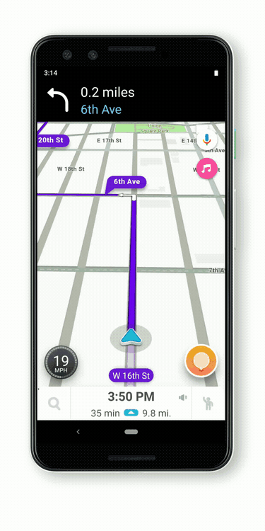|

## RQ11
| **RQ11** | **O aplicativo deve ter a opção para mudar a rota a qualquer momento** |
|--|--|
| **Épico** | [E01](https://requisitos-de-software.github.io/2019.2-Waze/ProductBacklog/#2-backlog) |
| **Feature** | [FT01](https://requisitos-de-software.github.io/2019.2-Waze/ProductBacklog/#2-backlog) 
| **US** | [US02](https://requisitos-de-software.github.io/2019.2-Waze/UserStories/#3-historias-de-usuario) [US05](https://requisitos-de-software.github.io/2019.2-Waze/UserStories/#3-historias-de-usuario)  |
| **Funcionalidade** | 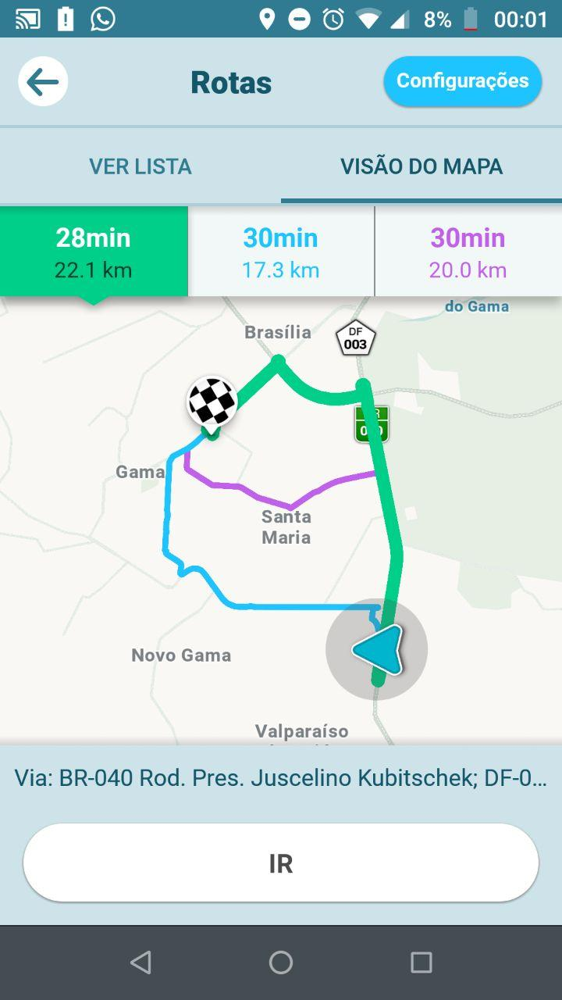| 

## RQ12
| **RQ12** | **O aplicativo deve disponibilizar uma funcionalidade para economia de bateria** |
|--|--|
| **Épico** | [E02](https://requisitos-de-software.github.io/2019.2-Waze/ProductBacklog/#2-backlog) |
| **Feature** | [FT03](https://requisitos-de-software.github.io/2019.2-Waze/ProductBacklog/#2-backlog) |
| **US** | [US20](https://requisitos-de-software.github.io/2019.2-Waze/UserStories/#3-historias-de-usuario)  |
| **Funcionalidade** | |

## RQ13
| **RQ13** | **O aplicativo deve ter um sistema de chat** |
|--|--|
| **Épico** |[E03](https://requisitos-de-software.github.io/2019.2-Waze/ProductBacklog/#2-backlog) |
| **Feature** | [FT05](https://requisitos-de-software.github.io/2019.2-Waze/ProductBacklog/#2-backlog)|
| **US** | [US27](https://requisitos-de-software.github.io/2019.2-Waze/UserStories/#3-historias-de-usuario)   |
| **Funcionalidade** | 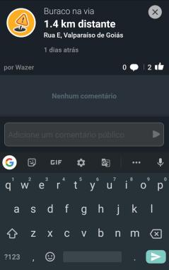|

## RQ14
| **RQ14** | **O aplicativo deve ter integração com aplicativos de streaming** |
|--|--|
| **Épico** |[E02](https://requisitos-de-software.github.io/2019.2-Waze/ProductBacklog/#2-backlog) |
| **Feature** |[FT03](https://requisitos-de-software.github.io/2019.2-Waze/ProductBacklog/#2-backlog) |
| **US** |  [US29](https://requisitos-de-software.github.io/2019.2-Waze/UserStories/#3-historias-de-usuario)  |
| **Funcionalidade** |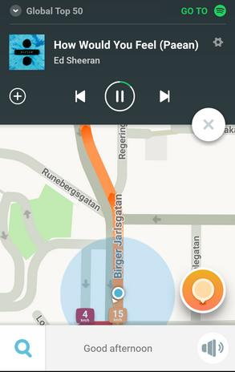 |

## RQ15
| **RQ15** | **O aplicativo deve ter o mapa atualizado** |
|--|--|
| **Épico** |[E03](https://requisitos-de-software.github.io/2019.2-Waze/ProductBacklog/#2-backlog) |
| **Feature** | [FT04](https://requisitos-de-software.github.io/2019.2-Waze/ProductBacklog/#2-backlog) |
| **US** |  [US07](https://requisitos-de-software.github.io/2019.2-Waze/UserStories/#3-historias-de-usuario)  [US22](https://requisitos-de-software.github.io/2019.2-Waze/UserStories/#3-historias-de-usuario)|
| **Funcionalidade** | -- |

## RQ16
| **RQ16** | **O usuário deve ser capaz de avaliar feedback de outros usuários** |
|--|--|
| **Épico** | [E03](https://requisitos-de-software.github.io/2019.2-Waze/ProductBacklog/#2-backlog) |
| **Feature** | [FT04](https://requisitos-de-software.github.io/2019.2-Waze/ProductBacklog/#2-backlog) [FT05](https://requisitos-de-software.github.io/2019.2-Waze/ProductBacklog/#2-backlog)|
| **US** |  [US14](https://requisitos-de-software.github.io/2019.2-Waze/UserStories/#3-historias-de-usuario) [US39](https://requisitos-de-software.github.io/2019.2-Waze/UserStories/#3-historias-de-usuario)|
| **Funcionalidade** | 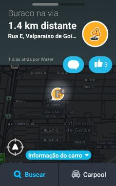|

## RQ17
| **RQ17** | **O aplicativo deve ser leve o suficiente para ter um bom desempenho na maioria dos dispositivos** |
|--|--|
| **Épico** | -- |
| **Feature** | -- |
| **US** | -- |
| **Funcionalidade** | --|

## RQ18
| **RQ18** | **O aplicativo deve intuitivo e agradável** |
|--|--|
| **Épico** |[E02](https://requisitos-de-software.github.io/2019.2-Waze/ProductBacklog/#2-backlog) |
| **Feature** | [FT03](https://requisitos-de-software.github.io/2019.2-Waze/ProductBacklog/#2-backlog)|
| **US** |  [US23](https://requisitos-de-software.github.io/2019.2-Waze/UserStories/#3-historias-de-usuario) |
| **Funcionalidade** | 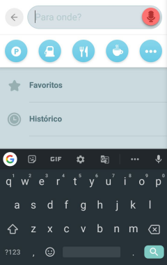|

## RQ19
| **RQ19** | **O aplicativo deve ter suporte offline** |
|--|--|
| **Épico** | [E02](https://requisitos-de-software.github.io/2019.2-Waze/ProductBacklog/#2-backlog) |
| **Feature** |[FT03](https://requisitos-de-software.github.io/2019.2-Waze/ProductBacklog/#2-backlog) |
| **US** | [US10](https://requisitos-de-software.github.io/2019.2-Waze/UserStories/#3-historias-de-usuario)   |
| **Funcionalidade** |  |

## RQ20
| **RQ20** | **O aplicativo deve ter suporte para anúncios** |
|--|--|
| **Épico** | -- |
| **Feature** | -- |
| **US** |  -- |
| **Funcionalidade** | -- |

## RQ21
| **RQ21** | **O usuário deve ser capaz de editar informações no mapa** |
|--|--|
| **Épico** | [E02](https://requisitos-de-software.github.io/2019.2-Waze/ProductBacklog/#2-backlog) |
| **Feature** | [FT03](https://requisitos-de-software.github.io/2019.2-Waze/ProductBacklog/#2-backlog)|
| **US** |  [US28](https://requisitos-de-software.github.io/2019.2-Waze/UserStories/#3-historias-de-usuario) |
| **Funcionalidade** | |

## RQ22
| **RQ22** | **O aplicativo deve ter opção de evitar algumas situações durante o percurso** |
|--|--|
| **Épico** | [E01](https://requisitos-de-software.github.io/2019.2-Waze/ProductBacklog/#2-backlog) |
| **Feature** | [FT01](https://requisitos-de-software.github.io/2019.2-Waze/ProductBacklog/#2-backlog)|
| **US** |  [US08](https://requisitos-de-software.github.io/2019.2-Waze/UserStories/#3-historias-de-usuario) [US33](https://requisitos-de-software.github.io/2019.2-Waze/UserStories/#3-historias-de-usuario)|
| **Funcionalidade** | 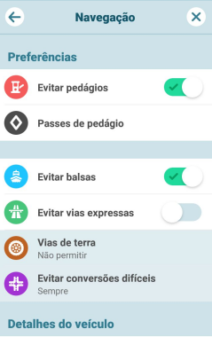|

## RQ23
| **RQ23** | **O aplicativo deve poder definir suas preferências de percurso** |
|--|--|
| **Épico** | [E01](https://requisitos-de-software.github.io/2019.2-Waze/ProductBacklog/#2-backlog) |
| **Feature** | [FT01](https://requisitos-de-software.github.io/2019.2-Waze/ProductBacklog/#2-backlog)|
| **US** |[US08](https://requisitos-de-software.github.io/2019.2-Waze/UserStories/#3-historias-de-usuario) [US33](https://requisitos-de-software.github.io/2019.2-Waze/UserStories/#3-historias-de-usuario)|
| **Funcionalidade** | |

## RQ24
| **RQ24** | **Precisão de rotas** |
|--|--|
| **Épico** | [E01](https://requisitos-de-software.github.io/2019.2-Waze/ProductBacklog/#2-backlog) |
| **Feature** | [FT01](https://requisitos-de-software.github.io/2019.2-Waze/ProductBacklog/#2-backlog)|
| **US** |  [US01](https://requisitos-de-software.github.io/2019.2-Waze/UserStories/#3-historias-de-usuario) [US19](https://requisitos-de-software.github.io/2019.2-Waze/UserStories/#3-historias-de-usuario) [US22](https://requisitos-de-software.github.io/2019.2-Waze/UserStories/#3-historias-de-usuario)|
| **Funcionalidade** |-- |

## RQ25
| **RQ25** | **Mudança de Interface** |
|--|--|
| **Épico** | [E02](https://requisitos-de-software.github.io/2019.2-Waze/ProductBacklog/#2-backlog) |
| **Feature** | [FT03](https://requisitos-de-software.github.io/2019.2-Waze/ProductBacklog/#2-backlog)|
| **US** |  [US35](https://requisitos-de-software.github.io/2019.2-Waze/UserStories/#3-historias-de-usuario) [US36](https://requisitos-de-software.github.io/2019.2-Waze/UserStories/#3-historias-de-usuario)|
| **Funcionalidade** | 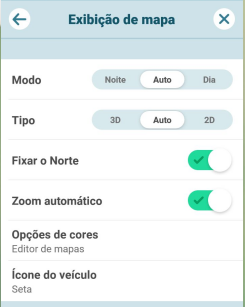|

## RQ26
| **RQ26** | **Veracidade de Informações de usuários** |
|--|--|
| **Épico** | [E03](https://requisitos-de-software.github.io/2019.2-Waze/ProductBacklog/#2-backlog)|
| **Feature** | [FT04](https://requisitos-de-software.github.io/2019.2-Waze/ProductBacklog/#2-backlog)|
| **US** |  [US39](https://requisitos-de-software.github.io/2019.2-Waze/UserStories/#3-historias-de-usuario)|
| **Funcionalidade** | inserir imagem |

## RQ27
| **RQ27** | **O aplicativo deve consumir menos rede de dados / opção offline** |
|--|--|
| **Épico** | [E02](https://requisitos-de-software.github.io/2019.2-Waze/ProductBacklog/#2-backlog)|
| **Feature** | [FT03](https://requisitos-de-software.github.io/2019.2-Waze/ProductBacklog/#2-backlog)|
| **US** |  [US10](https://requisitos-de-software.github.io/2019.2-Waze/UserStories/#3-historias-de-usuario)|
| **Funcionalidade** | -- |

## RQ28
| **RQ28** | **Design mais intuitivo** |
|--|--| 
| **Épico** | [E01, E02](https://requisitos-de-software.github.io/2019.2-Waze/ProductBacklog/#2-backlog)|
| **Feature** | [FT01, FT02, FT03](https://requisitos-de-software.github.io/2019.2-Waze/ProductBacklog/#2-backlog)|
| **US** |  [US03, US17, US18, US23, US34](https://requisitos-de-software.github.io/2019.2-Waze/UserStories/#3-historias-de-usuario)|
| **Funcionalidade** | Requisito não funcional |

## RQ29
| **RQ29** | **Integração com redes sociais** |
|--|--|
| **Épico** | [E03](https://requisitos-de-software.github.io/2019.2-Waze/ProductBacklog/#2-backlog)|
| **Feature** | [FT04](https://requisitos-de-software.github.io/2019.2-Waze/ProductBacklog/#2-backlog)|
| **US** |  [US12](https://requisitos-de-software.github.io/2019.2-Waze/UserStories/#3-historias-de-usuario)|
| **Funcionalidade** | 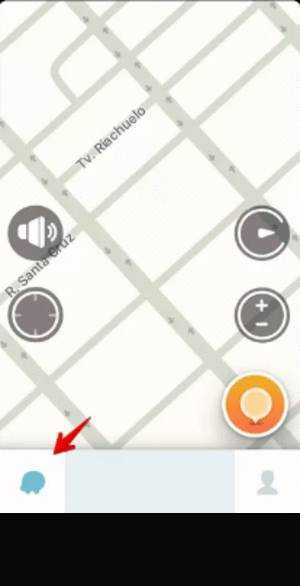 |

## RQ30
| **RQ30** | **Aumentar tamanho (km) de rotas** |
|--|--|
| **Épico** | [E01](https://requisitos-de-software.github.io/2019.2-Waze/ProductBacklog/#2-backlog)|
| **Feature** | [FT01](https://requisitos-de-software.github.io/2019.2-Waze/ProductBacklog/#2-backlog)|
| **US** |  [US01, US02, US05](https://requisitos-de-software.github.io/2019.2-Waze/UserStories/#3-historias-de-usuario)|
| **Funcionalidade** |  |

## RQ31
| **RQ31** | **Cadastro de usuário e login** |
|--|--|
| **Épico** | [E02](https://requisitos-de-software.github.io/2019.2-Waze/ProductBacklog/#2-backlog)|
| **Feature** | [FT03](https://requisitos-de-software.github.io/2019.2-Waze/ProductBacklog/#2-backlog)|
| **US** |  [US06](https://requisitos-de-software.github.io/2019.2-Waze/UserStories/#3-historias-de-usuario)|
| **Funcionalidade** |  |

## RQ32
| **RQ32** | **A aplicação tem que solicitar ao usuário que ele digite o trajeto do destino** |
|--|--|
| **Épico** | [E01](https://requisitos-de-software.github.io/2019.2-Waze/ProductBacklog/#2-backlog)|
| **Feature** | [FT01, FT02](https://requisitos-de-software.github.io/2019.2-Waze/ProductBacklog/#2-backlog)|
| **US** |  [US01, US02, US15, US16](https://requisitos-de-software.github.io/2019.2-Waze/UserStories/#3-historias-de-usuario)|
| **Funcionalidade** |  |

## RQ33
| **RQ33** | **A aplicação tem que solicitar ao usuário um destino** |
|--|--|
| **Épico** | [E01](https://requisitos-de-software.github.io/2019.2-Waze/ProductBacklog/#2-backlog)|
| **Feature** | [FT01, FT02](https://requisitos-de-software.github.io/2019.2-Waze/ProductBacklog/#2-backlog)|
| **US** |  [US01, US02, US15, US16](https://requisitos-de-software.github.io/2019.2-Waze/UserStories/#3-historias-de-usuario)|
| **Funcionalidade** | |

## RQ34
| **RQ34** | **Validar endereço** |
|--|--|
| **Épico** | [E01](https://requisitos-de-software.github.io/2019.2-Waze/ProductBacklog/#2-backlog)|
| **Feature** | [FT02](https://requisitos-de-software.github.io/2019.2-Waze/ProductBacklog/#2-backlog)|
| **US** |  [US16](https://requisitos-de-software.github.io/2019.2-Waze/UserStories/#3-historias-de-usuario)|
| **Funcionalidade** |  |

## RQ35
| **RQ35** |**O usuário tem que receber dicas de lugares para que ele possa ir caso tenha digitado metade do endereço ou o endereço errado** |
|--|--|
| **Épico** | [E01](https://requisitos-de-software.github.io/2019.2-Waze/ProductBacklog/#2-backlog)|
| **Feature** | [FT02](https://requisitos-de-software.github.io/2019.2-Waze/ProductBacklog/#2-backlog)|
| **US** |  [US15](https://requisitos-de-software.github.io/2019.2-Waze/UserStories/#3-historias-de-usuario)|
| **Funcionalidade** |   |

## RQ36

|**RQ36**|**O aplicativo deve informar ao usuário sobre o engarrafamento**|
|--|--|
| **Épico** | [E03](https://requisitos-de-software.github.io/2019.2-Waze/ProductBacklog/#2-backlog)|
| **Feature** | [FT04](https://requisitos-de-software.github.io/2019.2-Waze/ProductBacklog/#2-backlog)|
| **US** | [US38](https://requisitos-de-software.github.io/2019.2-Waze/UserStories/#3-historias-de-usuario)|
| **Funcionalidade** | 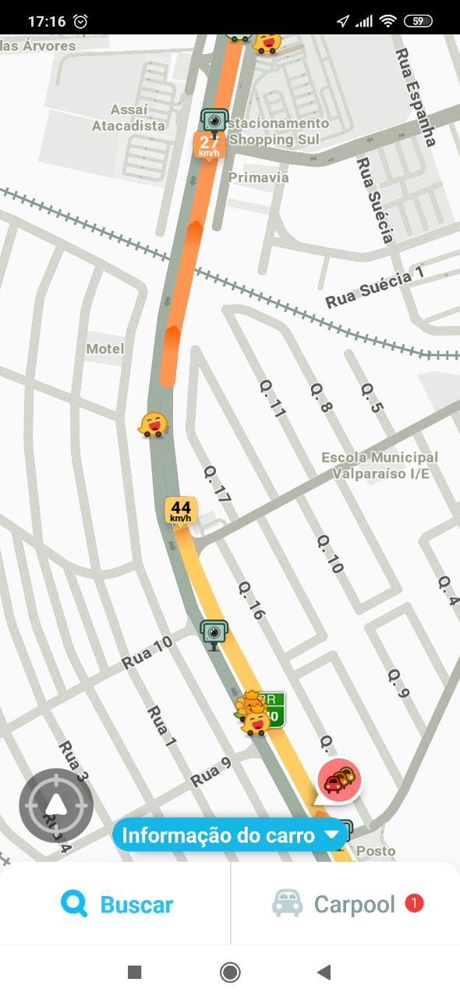 |

## RQ37

|**RQ37**|**O aplicativo deve informar sobre estabelecimentos de interesse para motoristas**|
|--|--|
| **Épico** | [E02](https://requisitos-de-software.github.io/2019.2-Waze/ProductBacklog/#2-backlog)|
| **Feature** | [FT03](https://requisitos-de-software.github.io/2019.2-Waze/ProductBacklog/#2-backlog)|
| **US** | [US13](https://requisitos-de-software.github.io/2019.2-Waze/UserStories/#3-historias-de-usuario)|
| **Funcionalidade** | 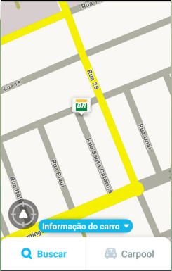|

## RQ38

|**RQ38**|**O aplicativo de informar o tempo do percurso**|
|--|--|
| **Épico** | [E02](https://requisitos-de-software.github.io/2019.2-Waze/ProductBacklog/#2-backlog)|
| **Feature** | [FT03](https://requisitos-de-software.github.io/2019.2-Waze/ProductBacklog/#2-backlog)|
| **US** | [US25](https://requisitos-de-software.github.io/2019.2-Waze/UserStories/#3-historias-de-usuario)|
| **Funcionalidade** |  |

## RQ39

|**RQ39**|**O aplicativo deve calcular a melhor rota para o destino desejado pelo usuário**|
|--|--|
| **Épico** | [E01](https://requisitos-de-software.github.io/2019.2-Waze/ProductBacklog/#2-backlog)|
| **Feature** | [FT01](https://requisitos-de-software.github.io/2019.2-Waze/ProductBacklog/#2-backlog)|
| **US** | [US24](https://requisitos-de-software.github.io/2019.2-Waze/UserStories/#3-historias-de-usuario)|
| **Funcionalidade** |  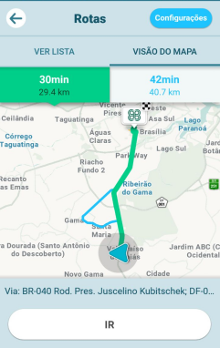|

## RQ40

|**RQ40**|**O aplicativo deve conter uma area comum para feedback do usuário**|
|--|--|
| **Épico** | [E02, E03](https://requisitos-de-software.github.io/2019.2-Waze/ProductBacklog/#2-backlog)|
| **Feature** | [FT03, FT04, FT05](https://requisitos-de-software.github.io/2019.2-Waze/ProductBacklog/#2-backlog)|
| **US** | [US14, US27, US36, US37, US39](https://requisitos-de-software.github.io/2019.2-Waze/UserStories/#3-historias-de-usuario)|
| **Funcionalidade** |  |

## RQ41

|**RQ41**|**O usuário deve ser informado sobre acontecimentos em sua rota**|
|--|--|
| **Épico** | |
| **Feature** | |
| **US** | [US08](https://requisitos-de-software.github.io/2019.2-Waze/UserStories/#3-historias-de-usuario)
[US09](https://requisitos-de-software.github.io/2019.2-Waze/UserStories/#3-historias-de-usuario)|
| **Funcionalidade** | |

## RQ42

|**RQ42**|**O aplicativo deve ter conexão com um aplicativo de mídia**|
|--|--|
| **Épico** | [E02, E03](https://requisitos-de-software.github.io/2019.2-Waze/ProductBacklog/#2-backlog)|
| **Feature** | [FT03, FT05](https://requisitos-de-software.github.io/2019.2-Waze/ProductBacklog/#2-backlog)|
| **US** | [US12, US29](https://requisitos-de-software.github.io/2019.2-Waze/UserStories/#3-historias-de-usuario)|
| **Funcionalidade** |  |

## RQ43

|**RQ43**|**A navegação deve funcionar offline**|
|--|--|
| **Épico** | [E02](https://requisitos-de-software.github.io/2019.2-Waze/ProductBacklog/#2-backlog)|
| **Feature** | [FT03](https://requisitos-de-software.github.io/2019.2-Waze/ProductBacklog/#2-backlog)|
| **US** | [US10](https://requisitos-de-software.github.io/2019.2-Waze/UserStories/#3-historias-de-usuario)|
| **Funcionalidade** |  --|

## RQ44

|**RQ44**|**O usuário deve receber informações sobre a via**|
|--|--|
| **Épico** | [E01, E03](https://requisitos-de-software.github.io/2019.2-Waze/ProductBacklog/#2-backlog)|
| **Feature** | [FT01, FT02, FT04](https://requisitos-de-software.github.io/2019.2-Waze/ProductBacklog/#2-backlog)|
| **US** | [US03, US07, US08, US22, US33, US34, US38](https://requisitos-de-software.github.io/2019.2-Waze/UserStories/#3-historias-de-usuario)|
| **Funcionalidade** |  |

## RQ45

|**RQ45**|**O usuário deve informar eventos na sua rota**|
|--|--|
| **Épico** | [E02](https://requisitos-de-software.github.io/2019.2-Waze/ProductBacklog/#2-backlog)|
| **Feature** | [FT03](https://requisitos-de-software.github.io/2019.2-Waze/ProductBacklog/#2-backlog)|
| **US** | [US28](https://requisitos-de-software.github.io/2019.2-Waze/UserStories/#3-historias-de-usuario)|
| **Funcionalidade** | 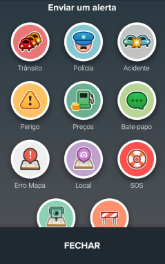 |

## RQ46

|**RQ46**|**O usuário deve ser informado sobre estabelecimentos próximos**|
|--|--|
| **Épico** | [E02](https://requisitos-de-software.github.io/2019.2-Waze/ProductBacklog/#2-backlog)|
| **Feature** | [FT03](https://requisitos-de-software.github.io/2019.2-Waze/ProductBacklog/#2-backlog)|
| **US** | [US13, US26](https://requisitos-de-software.github.io/2019.2-Waze/UserStories/#3-historias-de-usuario)|
| **Funcionalidade** | |

## RQ47

|**RQ47**|**O Waze deve mostrar um pequeno resumo sobre o que é o app**|
|--|--|
| **Épico** | |
| **Feature** | |
| **US** | |
| **Funcionalidade** | 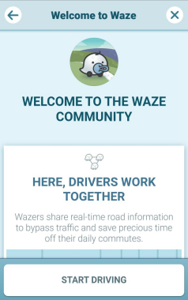|

## RQ48

|**RQ48**|**O usuário deve ser capaz de utilizar o app sem fazer um cadastro/login**|
|--|--|
| **Épico** | |
| **Feature** | |
| **US** | |
| **Funcionalidade** |  |

## RQ49

|**RQ49**|**Deve ser mostrado os termos de serviços**|
|--|--|
| **Épico** | |
| **Feature** | |
| **US** | |
| **Funcionalidade** |  |

## RQ50

|**RQ50**|**O usuário deve ser capaz de informar que tipo de carro utiliza**|
|--|--|
| **Épico** | |
| **Feature** | |
| **US** | |
| **Funcionalidade** |  |

## RQ51

|**RQ51**|**O usuário deve ser capaz de informar o destino**|
|--|--|
| **Épico** | |
| **Feature** | |
| **US** | |
| **Funcionalidade** |  |

## RQ52

|**RQ52**|**O Aplicativo deve informar o tempo do percurso**|
|--|--|
| **Épico** | |
| **Feature** | |
| **US** | |
| **Funcionalidade** |  |

## RQ53

|**RQ53**|**O Aplicativo deve informar a hora de chegada no destino**|
|--|--|
| **Épico** | |
| **Feature** | |
| **US** | |
| **Funcionalidade** |  |

## RQ54

|**RQ54**|**O Aplicativo deve informar a velocidade do veiculo**|
|--|--|
| **Épico** | |
| **Feature** | |
| **US** | |
| **Funcionalidade** |  |

## RQ55

|**RQ55**|**O usuario deve ser capaz de informar eventos na rota, como transito, acidentes e radares**|
|--|--|
| **Épico** | |
| **Feature** | |
| **US** | |
| **Funcionalidade** |  |

## RQ56

|**RQ56**|**O usuário deve ser capaz de alterar a rota**|
|--|--|
| **Épico** | |
| **Feature** | |
| **US** | |
| **Funcionalidade** |  |

## RQ57

|**RQ57**|**O usuário deve ser capaz de compartilhar sua rota**|
|--|--|
| **Épico** | |
| **Feature** | |
| **US** | |
| **Funcionalidade** |  |

## RQ58

|**RQ58**|**O waze deve ter uma opção de economia de bateria**|
|--|--|
| **Épico** | |
| **Feature** | |
| **US** | |
| **Funcionalidade** |  |

## Referência Bibliográfica

>GuiaBolso-Requisitos. Disponível em: https://fga-disciplinas.github.io/2019.1-Guia-Bolso/pos-rastreabilidade/forward/ . Acesso em 12/11/2019.

> DAVIS, A. M.; Software   Requirements:   Objects,   Functions   and   States. Englewood Cliffs, New Jersey: Prentice Hall. 1993. 

> SOMMERVILLE, I.; Software Engineering. Addison-Wesley, Reading, MA, 1998.

> SAYÃO, M., LEITE, J. C. S. P.; Rastreabilidade de Requisitos. Monografia em Ciências da Computação, No. 20/05. Departamento de Informática, PUC-RJ, Rio de Janeiro, 2005. Disponível em: http://www.dbd.puc-rio.br/depto_informatica/05_20_sayao.pdf 

## Histórico de Versões

|Data|Versão|Descrição|Autor(es)|
|----|------|---------|---------|
|18/11/19|1.0|Criação do documento|Matheus Estanislau, Lucas Alexandre|
|18/11/19|1.1|Adicionado detalhes de 7 a 13|Lucas Alexandre|
|18/11/19|1.2|Adicionado detalhes de 13 a 24|Lucas Alexandre|
|18/11/19|1.3|Detalhe dos RQ's 8 a 24 atualizados|Matheus Estanislau|
|24/11/19|1.4|Adicionados detalhes RQ's 25 ao 47 |Jõao Pedro, Renan Cristyan, Matheus Estanislau|
