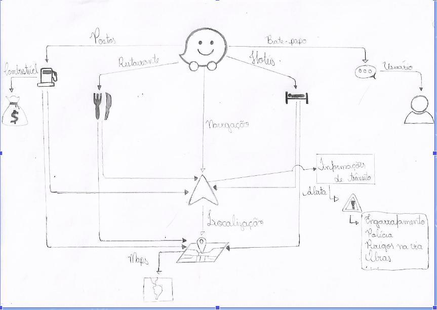
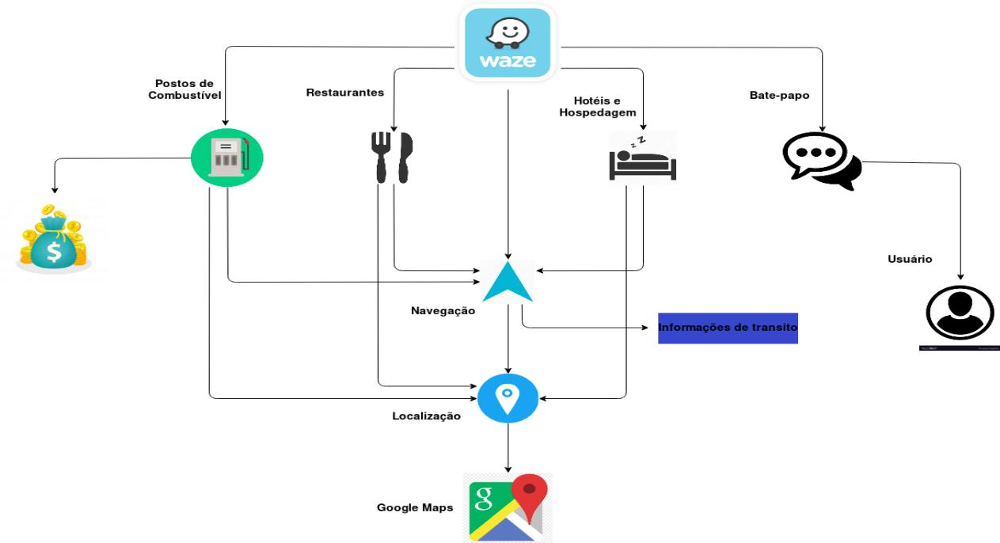
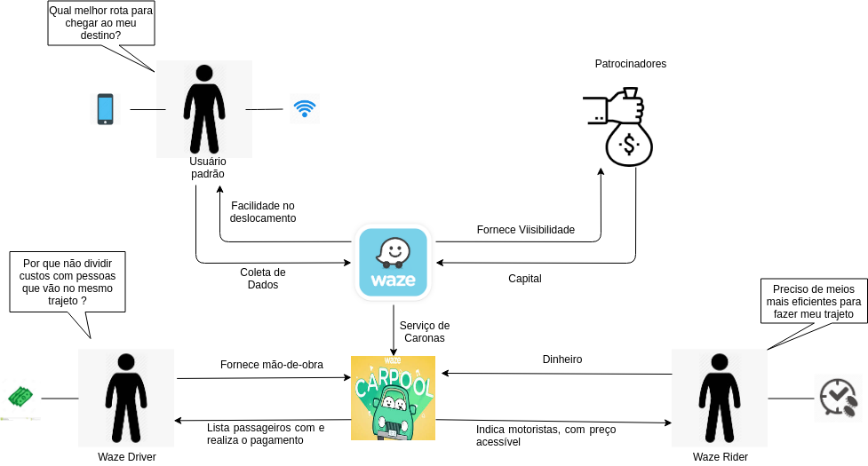
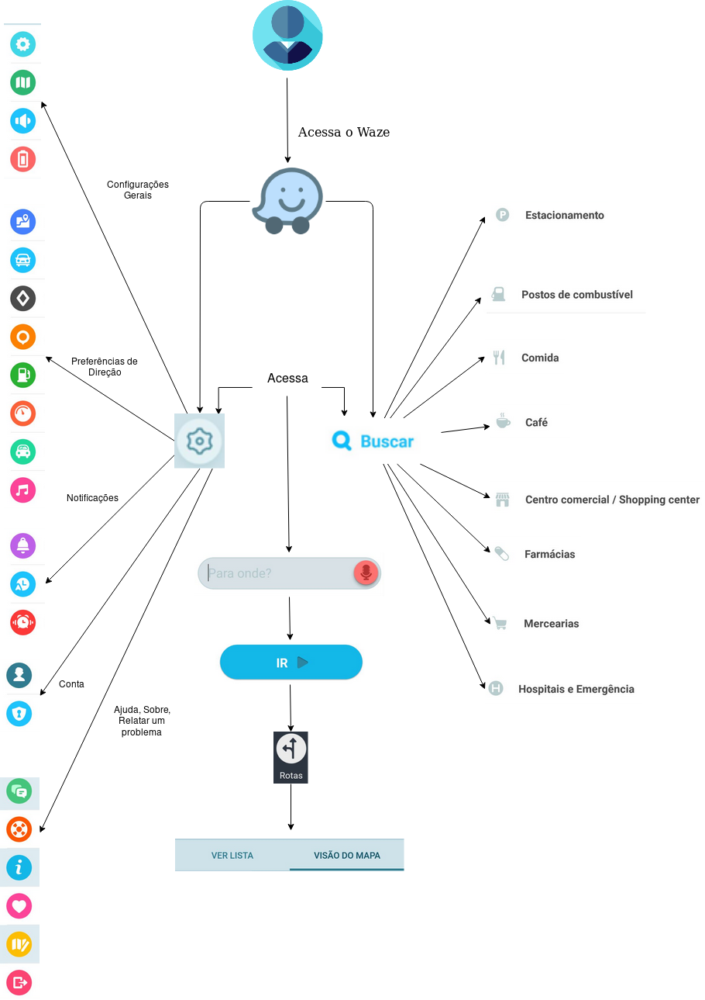

# RichPicture

## Introdução

Um Rich Picture é um desenho que ilustra os principais elementos e relacionamentos que precisam ser considerados na tentativa de auxiliar a representação de sistemas. Consiste em figuras, texto, símbolos e ícones, todos usados ​​para ilustrar a situação. É chamado de Rich Picture, pois ilustra a riqueza e a complexidade de uma situação.

## Metologia

    Para a criação dos richpictures foi utilizado a ferramenta <a href="https://www.draw.io">Draw.io</a>. Além disso utilizaremos a seguinte tabela para versionamento

## RP 00 Visão Geral

## RP 01 Visão Geral 

## RP 02 Atores

## RP 03 Usabilidade

## Versionamento

|   Data   | Versão |           Descrição           |             Autor(es)              |
|:--------:|:------:|:-----------------------------:|:----------------------------------:|
| 01/09/2019 |  1.0   |    Realizado primeiro RichPicture contendo a visão geral    |  Matheus Estanislau e Moacir Mascarenhas|
| 03/09/2019 |  1.0   | Foi utilizado o Draw.io para melhor visualização do richpicture   |  Matheus Estanislau|
| 07/09/2019 |  1.0   | Acrescentado RichPicture Atores   |  Matheus Estanislau e Guilherme Leal|
| 07/09/2019 |  1.0   | Acrescentado RichPicture de Usabilidade   |  Matheus Estanislau e Guilherme Leal|